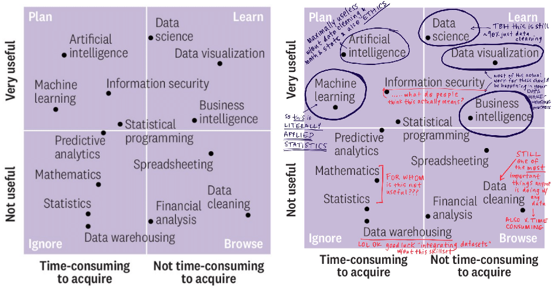

```{r setup, include=FALSE}
knitr::opts_chunk$set(
  echo = TRUE, 
  message = FALSE, 
  warning = FALSE,
  error = FALSE,
  fig.align = 'center',
  out.width='85%')
```

```{r, include=FALSE}
library(readr) 
library(dplyr) 
library(ggplot2)
```

# Logística del curso

## Algunos acuerdos

- Cámaras abiertas cuando sea posible (y si el internet lo permite)
- Micrófonos cerrados 
  * A menos que tengan preguntas
- PPT se subirá a CANVAS después de cada clase
- Aprender haciendo
  * Demostraciones, ejercicios, tareas
- **Dedicación de tiempo**

## Información general (i)

- 10 clases
  * última clase: presentaciones
- Sin ayudante
- Consultas por CANVAS fuera del horario de clases
- Hora de consulta (Zoom): Todos los lunes 18:00-19:00
  * A menos que se diga lo contrario

  
## Información general (ii)

- 4 tareas: 40% (10% c/u)
- Trabajo: 50%
  * Informe preliminar (10%)
  * Informe final (20%)
  * Presentación (20%)
- Participación

## Me presento

- Pablo Aguirre Hörmann - pjaguirreh@gmail.com
  * Ing. Agrónomo (UC) y MPP (U. of Chicago)
  * Análisis e Inteligencia de Negocios - Superintendencia del Medio Ambiente
  * https://github.com/pjaguirreh
  * @PAguirreH

## Ahora ustedes

```{r, echo=FALSE}
knitr::include_url("https://www.mentimeter.com/s/90dd52126ac4a3ae047c8703e046f6ea/6acc37749dbb/edit")
```

# ¿De qué se trata este curso?

## ¿De qué se trata este curso?

Usar datos...

- para facilitar tareas
- para aprender algo
- para informar decisiones
- para el bien común (¿?)

## Muchos datos en la actualidad

```{r, echo=FALSE, out.width='750px'}

```

## Los datos pueden ser bonitos

```{r, echo=FALSE, out.width='850px'}

```

## Los datos pueden ser informativos

```{r, echo=FALSE, out.width='700px'}

```

## Los datos pueden ser poderosos

```{r, echo=FALSE, out.width='890px'}

```

*Yeh et al., 2020. Nature*

## Los datos pueden ser engañosos

```{r, echo=FALSE, out.width='700px'}

```

## Los datos pueden ser peligrosos (i)

```{r, echo=FALSE, out.width='900px'}

```

## Los datos pueden ser peligrosos (ii)

```{r, echo=FALSE, out.width='400px'}

```

## Los datos pueden ser peligrosos (iii)

```{r, echo=FALSE, out.width='900px'}

```

## ¿Qué hacer entonces?

```{r, echo=FALSE, out.width='500px'}

```

## Ustedes ya saben de estas cosas

- Métodos econométricos
- Gestión, representación, y análisis de datos
- Evaluación de impacto
- Otros...

## Una pregunta más

```{r, echo=FALSE}
knitr::include_url("https://www.mentimeter.com/s/c51e8cbfd24627404654ac8f31a1c5b0/48c03c04ba24/edit")
```

## Foco de este curso

```{r, out.width='80%',  echo = FALSE, out.width='800px'}
knitr::include_graphics("Imagenes/ProcesoDS.png")
```

**Productores de análisis**

## Pero también mejores consumidores... {.smaller}

```{r, echo=FALSE, out.width='850px'}

```

https://hbr.org/2018/10/prioritize-which-data-skills-your-company-needs-with-this-2x2-matrix

## En específico

- Visualización de datos
- Manejo de datos
- Regresión/Clasificación
- Predicción vs Inferencia
- Aprendizaje no supervisado
- Automatización (¿?)
- **PROGRAMACIÓN**

# ¿Por qué programar?

## Reproducibilidad (i)

**Objetivo: realizar un reporte basado en datos de [Datos Públicos](http://datos.gob.cl/)**

## Reproducibilidad (i)

**Objetivo: realizar un reporte basado en datos de [Datos Públicos](http://datos.gob.cl/)**

<div style="float: left; width: 50%;">

**<span style="color:red">SIN PROGRAMACIÓN</span>**

1. Ingresar a la web y descargar datos
2. Limpiar datos en *MS Excel*
3. Analizar datos en *Stata*
4. Escribir documento en *MS Word*

</div>

<div style="float: right; width: 50%;">


</div>

## Reproducibilidad (i)

**Objetivo: realizar un reporte basado en datos de [Datos Públicos](http://datos.gob.cl/)**

<div style="float: left; width: 50%;">

**<span style="color:red">SIN PROGRAMACIÓN</span>**

1. Ingresar a la web y descargar datos
2. Limpiar datos en *MS Excel*
3. Analizar datos en *Stata*
4. Escribir documento en *MS Word*

</div>

<div style="float: right; width: 50%;">

**<span style="color:green">CON PROGRAMACIÓN</span>**

1. Crear una carpeta específica para el proyecto/tarea
    * `datos`
    * `gráficos`
    * `resultados`
2. Descargar datos desde `R`
3. Limpiar datos en `R`
4. Analizar datos en `R`
5. Escribir documento en `R Markdown`

</div>

## Reproducibilidad (ii)

**Seis meses después quieres repetir la tarea (o un/a coleg@)**

## Reproducibilidad (ii)

**Seis meses después quieres repetir la tarea (o un/a coleg@)**

<div style="float: left; width: 50%;">

**<span style="color:red">SIN PROGRAMACIÓN</span>**

1. Recordar que se hizo
2. Ingresar a la web y descargar datos
3. Limpiar datos en MS Excel y esperar no haberse olvidado de nada
3. Analizar datos en Stata
4. Escribir documento en MS Word

</div>

<div style="float: right; width: 50%;">


</div>

## Reproducibilidad (ii)

**Seis meses después quieres repetir la tarea (o un/a coleg@)**

<div style="float: left; width: 50%;">

**<span style="color:red">SIN PROGRAMACIÓN</span>**

1. Recordar que se hizo
2. Ingresar a la web y descargar datos
3. Limpiar datos en MS Excel y esperar no haberse olvidado de nada
3. Analizar datos en Stata
4. Escribir documento en MS Word

</div>

<div style="float: right; width: 50%;">

**<span style="color:green">CON PROGRAMACIÓN</span>**

1. Re-correr el código

</div>

## R y Tidyverse

- Hay muchos lenguajes de programación
- Hay muchas formas de escribir código en `R`

```{r, echo=FALSE}
knitr::include_url("https://www.tidyverse.org/packages/")
```

## Fuentes valiosas de información (i)

```{r, echo = FALSE, out.width='600px'}
knitr::include_graphics("Imagenes/Libros.PNG")
```

- https://r4ds.had.co.nz/ | https://es.r4ds.hadley.nz/
- http://faculty.marshall.usc.edu/gareth-james/ISL/

## Fuentes valiosas de información (ii)

```{r, echo = FALSE, out.width='450px'}
knitr::include_graphics("Imagenes/FuentesInformacion.PNG")
```

## Suficiente bla bla...

```{r, echo = FALSE, out.width='500px'}
knitr::include_graphics("Imagenes/tenor.gif")
```

## Demo - Ejercicio

- script: `EjercicioRepasoR.R`

# Cosas a tener en cuenta

## Tipos de datos

```{r, echo = FALSE, out.width='800px'}
knitr::include_graphics("Imagenes/TipoDatos.png")
```

## Pipe

`%>%` nos permite definir nuestras acciones como una secuencia

- Código "anidado"
```{r, eval = FALSE}
estacionar(manejar(buscar(llaves), hacia = "trabajo"))
```

- Código como secuencia
```{r, eval = FALSE}
llaves %>% 
  buscar() %>% 
  manejar(hacia = "trabajo") %>% 
  estacionar()
```

## Simpre hay más de una forma de hacer lo mismo

```{r, eval=FALSE}
datos_mundo[datos_mundo$anio == 2007,]
subset(datos_mundo, anio == 2007)
filter(datos_mundo, anio == 2007) 
datos_mundo %>% filter(anio == 2007) 
```

```{r, echo = FALSE}
datos_mundo <- read_csv("datos/datos_mundo.csv")
datos_mundo %>% filter(anio == 2007) 
```

## ... incluyendo los gráficos

```{r, echo=FALSE}
knitr::include_url("https://flowingdata.com/2016/03/22/comparing-ggplot2-and-r-base-graphics/")
```

## Además de libros y google...

Siempre consulten `?nombrefunción`. Ej: `?ggplot`

```{r, echo=FALSE, out.width='500px'}
knitr::include_graphics("Imagenes/Help.PNG")
```

## ¿Qué se viene?

- Semana 2: Visualización de datos
- Semana 3: Manejo de datos
  + Entregables: Idea de trabajo y Tarea 1