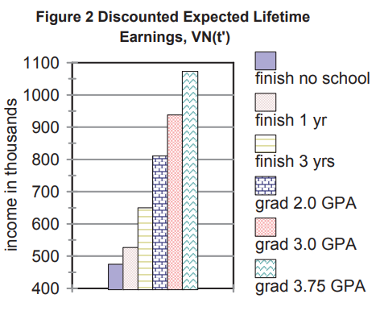
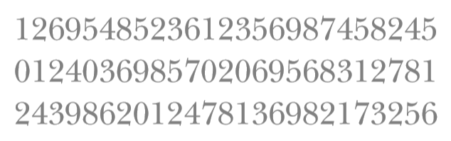
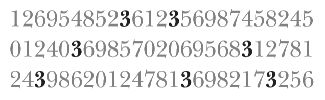
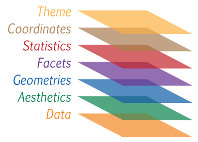
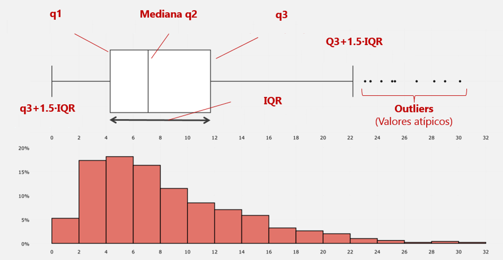

```{r setup, include=FALSE}
knitr::opts_chunk$set(
  echo = TRUE, 
  message = FALSE, 
  warning = FALSE,
  error = FALSE,
  fig.align = 'center',
  out.width='60%')
```

```{r, include=FALSE}
library(readxl)
library(tidyverse)
library(patchwork)
library(flair)
```

## ¿Qué veremos hoy?

- ¿Qué es y por qué visualizar datos?
- Visualización con `ggplot2`
- Demostraciones
  + `Clase02_CodigoViz.R`
  + `Clase02_CodigoCovid.R`
- Ejercicio
  + `Clase02_Ejercicio.R`
- Tarea

## Antes de empezar

- ¿Alguna pregunta?

# ¿Qué es y por qué visualizar datos?

## Dos razones principales de por qué visualizar

- **Para uno**: entender los datos con el fin de guiar análisis posteriores (análisis exploratorio)
- **Para otros**: contar una historia sobre los datos y resultados con el fin de comunicar algo

## Lo que deberíamos buscar

- Mostrar los datos
- No mentir con estos
- Contar una historia (¿una relación? ¿causalidad? ¿un patrón? ¿un quiebre?)
- Reducir el ruido (o lo innecesario)
- Transmitir y convencer
- Visualizaciones deben complementar el texto y tener suficiente información para "sobrevivir por sí mismas"

## ¿Qué opinan?

```{r, echo = FALSE, out.width='600px'}

```

## Una idea general

- El cerebro solo puede procesar un cierto número de atributos de forma instantanea (*pre-attentive attributes*)
  + Forma, posición, color, tamaño
- Queremos buscar la variación justa en estos atributos para enfocarnos en lo que importa

## ¿Cuántos 3 hay?

```{r, echo = FALSE, out.width='600px'}

```

## ¿Cuántos 3 hay?

```{r, echo = FALSE, out.width='600px'}

```

¿Y ahora?

```{r, echo = FALSE, out.width='600px'}

```

## Principios de (Edward) Tufte 

https://www.edwardtufte.com/tufte/

- Muestra los datos
- Maximiza la razón datos/*tinta*
- Borra (lo más posible) la *tinta* que no corresponda a datos 
- Borra *tinta* redundante
- Evita la *basura visual*
- Gráficos deben tender a ser horizontales

## Apliquemos los principios

```{r, echo = FALSE, out.width='600px'}

```

## Tratemos de hacerlo mejor

```{r, echo  = FALSE, out.width='800px'}
datos_graf <- data.frame(
  educ = c("Finish no school", "Finish 1 year", "Finish 3 years", "Graduate, 2.0 GPA", "Graduate, 3.0 GPA", "Graduate, 3.75 GPA"),
  inc = c(480, 520, 650, 810, 940, 1070)
)

ggplot(datos_graf, aes(x = reorder(educ, -inc), y = inc)) +
  geom_col(width = 0.5, fill = "dark blue") +
  coord_flip() +
  labs(x = NULL, y = NULL) +
  scale_y_continuous(n.breaks = 9) +
  theme_minimal() +
  theme(panel.grid.major.y = element_blank(),
        panel.grid.minor.y = element_blank(),
        panel.grid.major.x = element_line(colour = "dark blue", size = 0.1)) +
  labs(title = "Discounted Expected Lifetime Earnings, VN(t')",
       subtitle = "(Income in thousands)")
```

## Que hay por detrás | `ggplot2`

```{r, eval=FALSE}
ggplot(datos_graf, aes(x = reorder(educ, -inc), y = inc)) +
  geom_col(width = 0.5, fill = "dark blue") +
  coord_flip() +
  labs(x = NULL, y = NULL) +
  scale_y_continuous(n.breaks = 9) +
  theme_minimal() +
  theme(panel.grid.major.y = element_blank(),
        panel.grid.minor.y = element_blank(),
        panel.grid.major.x = element_line(colour = "dark blue", size = 0.1)) +
  labs(title = "Discounted Expected Lifetime Earnings, VN(t')",
       subtitle = "(Income in thousands)")
```

# Visualización de datos en R con ggplot2

## Lógica de `ggplot2`

"gg" por [Grammar of Graphics](https://www.springer.com/gp/book/9780387245447)

```{r, echo = FALSE, out.width='600px'}

```

## Forma general de `ggplot2`

```{r, eval = FALSE}
library(ggplot2)
ggplot(datos, aes(x = var1, y = var2)) +
  geom_XXX(...) +
  otros(...)
```

- `geom_point()`
- `geom_line()`
- `geom_xxxx()`
- `facet`
- `theme`

# Demo - Visualizar Datos de indicadores de países

## Demo | Script

- `Clase02_CodigoViz.R`

## Datos 

```{r}
library(readr)
(datos_mundo <- read.csv("datos/datos_mundo2007.csv"))
```

# Gráficos con una variable

## Histograma | Gráfico base (datos)

```{r}
ggplot(datos_mundo)
```

## Histograma | Agregar capa (`aes`)

```{r}
ggplot(datos_mundo, aes(x = gdpPercap))
```

## Histograma | Agregar capa (`geom`)

```{r}
ggplot(datos_mundo, aes(x = gdpPercap)) +
  geom_histogram()
```

## Histograma | cambiar algunos argumentos{.smaller}

<div style="float: left; width: 45%;">

```{r, out.width='100%'}
ggplot(datos_mundo, aes(x = gdpPercap)) +
  geom_histogram(bins = 100, fill = "blue")
```

</div>

<div style="float: right; width: 50%;">

```{r, out.width='100%'}
ggplot(datos_mundo, aes(x = gdpPercap)) +
  geom_histogram(binwidth = 5000, col = "blue")
```

</div>

## Muchos argumentos | No olviden...

Siempre consulten `?nombrefunción`. Ej: `?ggplot`

```{r, echo=FALSE, out.width='500px'}
knitr::include_graphics("Imagenes/Help.PNG")
```

# Gráficos con dos variables

## Una variable categórica y una numérica | Gráfico base

```{r}
ggplot(datos_mundo, aes(x = continente, y = gdpPercap))
```

## Una variable categórica y una numérica | capa de puntos (`geom_point`)

```{r}
ggplot(datos_mundo, aes(x = continente, y = gdpPercap)) +
  geom_point()
```

## Boxplot

```{r}
ggplot(datos_mundo, aes(x = continente, y = gdpPercap)) +
  geom_boxplot()
```

## ¿Qué nos muestra el boxplot?

```{r, echo=FALSE, out.width='800px'}

```

## Juntar más de una capa (`geom`)

```{r}
ggplot(datos_mundo, aes(x = continente, y = gdpPercap)) +
  geom_boxplot() +
  geom_point()
```

## Invertir los ejes

```{r}
ggplot(datos_mundo, aes(x = continente, y = gdpPercap)) +
  geom_boxplot() +
  geom_point() +
  coord_flip()
```

## Dos variables numéricas | Gráfico de dispersión 

```{r}
ggplot(datos_mundo, aes(x = gdpPercap, y = ExpVida)) +
  geom_point()
```

## También se puede cambiar el color de los puntos

```{r}
ggplot(datos_mundo, aes(x = gdpPercap, y = ExpVida)) +
  geom_point(col = "red")
```

## O usar el color para agregar más información

```{r}
ggplot(datos_mundo, aes(x = gdpPercap, y = ExpVida)) +
  geom_point(aes(col = continente))
```

## Agregar linea de tendencia (i)

```{r}
ggplot(datos_mundo, aes(x = gdpPercap, y = ExpVida)) +
  geom_point() +
  geom_smooth()
```

## Agregar linea de tendencia (ii) {.smaller}

<div style="float: left; width: 45%;">

```{r, out.width='100%'}
ggplot(datos_mundo, 
       aes(x = log(gdpPercap), y = ExpVida)) +
  geom_point() +
  geom_smooth(se = FALSE, method = "lm")
```

</div>

<div style="float: right; width: 45%;">

```{r, out.width='100%'}
ggplot(datos_mundo, 
       aes(x = gdpPercap, y = ExpVida)) +
  geom_point() +
  geom_smooth(se = FALSE, method = "lm", 
              formula = y ~ log(x))
```

</div>

# Ejercicio

## Ejercicio | Script

- `Clase02_Ejercicio.R`

## Respuestas {.smaller}

```{r, eval = FALSE}
# Hacer un histograma de "ExpVida" utilizando 15 divisiones/barras (bins)
ggplot(datos_ejercicio, aes(x = ExpVida)) +
  geom_histogram(bins = 15)

# Hacer un gráfico de puntos de "anio" (x) vs "ExpVida" (y)
ggplot(datos_ejercicio, aes(x = anio, y = ExpVida)) +
  geom_point()

# Repetir el gráfico anterior y diferenciar los puntos con un color distinto según su continente
ggplot(datos_ejercicio, aes(x = anio, y = ExpVida, col = continente)) +
  geom_point()

# Agregar al gráfico anterior un geom de lineas (geom_line)
ggplot(datos_ejercicio, aes(x = anio, y = ExpVida, col = continente)) +
  geom_point() +
  geom_line()

# Repetir el gráfico anterior para las otras dos variables presentes en "datos_ejercicio"
ggplot(datos_ejercicio, aes(x = anio, y = pob, col = continente)) +
  geom_point() +
  geom_line()

ggplot(datos_ejercicio, aes(x = anio, y = gdpPercap, col = continente)) +
  geom_point() +
  geom_line()
```

# Demo - Datos COVID

## Demo | Script

- `Clase02_CodigoCovid.R`

## Datos COVID-19 | Cargar datos {.smaller}

```{r}
library(readr)
(datos_covid <- read_csv("datos/covid_datos_region.csv"))
```

<font size="2"> Datos creados a partir de API generada por *@pachamaltese* (https://github.com/pachamaltese) para DATA UC (https://coronavirus.mat.uc.cl/)</font>
  
## Gráfico base {.smaller}

```{r graf1}
library(ggplot2)
ggplot(datos_covid, aes(x = fecha, y = casos_covid_pob))
```

## Agregar `geom` de lineas | Pero algo se ve mal {.smaller}

```{r graf4}
ggplot(datos_covid, aes(x = fecha, y = casos_covid_pob)) +
  geom_line()
```

## Cada linea representa una región (i) {.smaller}

```{r graf4b}
ggplot(datos_covid, aes(x = fecha, y = casos_covid_pob, group = region)) +
  geom_line()
```

## Cada linea representa una región (ii) {.smaller}

```{r graf5}
ggplot(datos_covid, aes(x = fecha, y = casos_covid_pob, col = region)) +
  geom_line()
```

## Separemos cada linea en su propio panel (i) {.smaller}

```{r graf8}
ggplot(datos_covid, aes(x = fecha, y = casos_covid_pob)) +
  geom_line(aes(col = region), size = 1) +
  facet_wrap(vars(region ))
```

## Separemos cada linea en su propio panel (ii) {.smaller}

```{r graf8b}
ggplot(datos_covid, aes(x = fecha, y = casos_covid_pob)) +
  geom_line(aes(col = region), size = 1) +
  facet_wrap(vars(region), scales = "free_y")
```

## Separemos cada linea en su propio panel (iii) {.smaller}

```{r graf8c}
ggplot(datos_covid, aes(x = fecha, y = casos_covid_pob)) +
  geom_line(aes(col = region), size = 1) +
  facet_wrap(vars(region), ncol = 5)
```

## Fondo blanco pareciera quedar mejor (i) {.smaller}

```{r graf9}
ggplot(datos_covid, aes(x = fecha, y = casos_covid_pob)) +
  geom_line(aes(col = region), size = 1) +
  facet_wrap(vars(region)) +
  theme_bw()
```

## Fondo blanco pareciera quedar mejor (ii) {.smaller}

```{r graf9b}
ggplot(datos_covid, aes(x = fecha, y = casos_covid_pob)) +
  geom_line(aes(col = region), size = 1) +
  facet_wrap(vars(region)) +
  theme_minimal()
```

## La leyenda pareciera no ser de mucha ayuda {.smaller}

```{r graf10}
ggplot(datos_covid, aes(x = fecha, y = casos_covid_pob)) +
  geom_line(aes(col = region), size = 1) +
  facet_wrap(vars(region)) +
  theme_minimal() +
  theme(legend.position = "none")
```

## "Themes" prefabricados | https://ggplot2.tidyverse.org/reference/ggtheme.html

```{r, echo = FALSE}
knitr::include_url("https://ggplot2.tidyverse.org/reference/ggtheme.html")
```

## Cómo modificar detalles de nuestos gráficos

```{r, echo = FALSE, out.width='700px'}
knitr::include_graphics("Imagenes/ggplot2Elements.jpg")
```

## Títulos/Ejes como detalles finales {.smaller}

```{r graf11}
ggplot(datos_covid, aes(x = fecha, y = casos_covid_pob)) +
  geom_line(aes(col = region), size = 1) +
  facet_wrap(vars(region)) + theme_minimal() +
  theme(legend.position = "none") +
  labs(title = "Evolución casos COVID-19 en Chile por región",
       subtitle = "La región de Tarapacá y Metropolitana lideran la tabla",
       x = NULL, y = "Casos por cada 10.000 habitantes")
```

## Muchas más posibilidades | https://www.data-to-viz.com/

```{r, echo = FALSE}
knitr::include_url("https://www.data-to-viz.com/")
```

## Tarea 1

- Criticar gráfico y proponer uno mejor
- Buscar un gráfico, criticarlo, y proponer uno mejor

## Idea de trabajo

- Jueves 20 de agosto
- Instrucciones en CANVAS

## Siguiente clase

- Manejo de datos
- `install.packages("dplyr")`
- `install.packages("tidyr")`