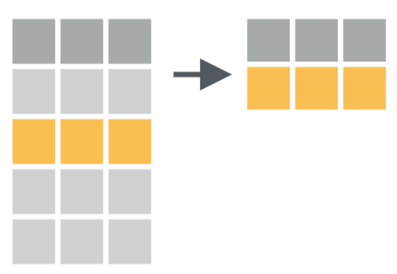
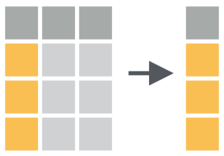
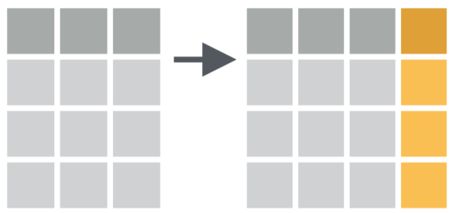
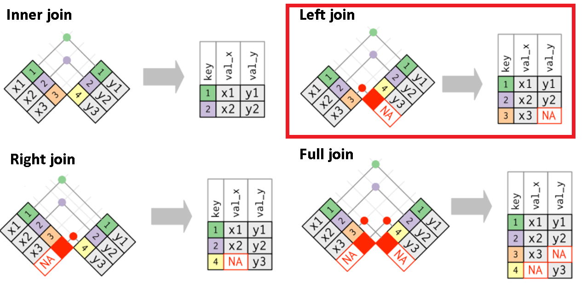
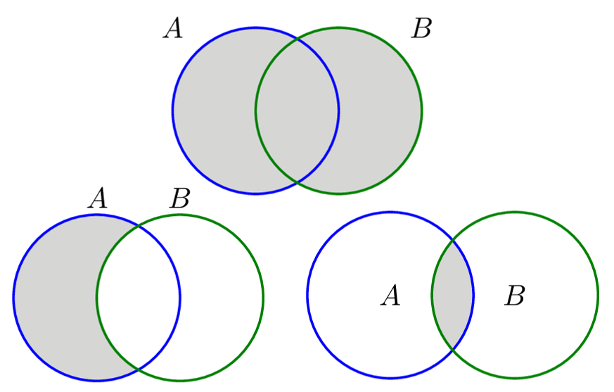

```{r setup, include=FALSE}
knitr::opts_chunk$set(
  echo = TRUE, 
  message = FALSE, 
  warning = FALSE,
  error = FALSE,
  fig.align = 'center',
  out.width='60%')

library(readr)
library(tidyverse)

datosONU_tidy <- read_csv("datos/DatosONU_tidy.csv")
```

## Antes de empezar | Preguntas/Comentarios

- General
- Tarea
- Idea de trabajo
- Otros

## ¿Qué veremos hoy?

- Manejo de datos con `dplyr`
  * Verbos de manipulación de datos
  * Trabajo con una y más tablas
- **Muchas funciones**

```{r, out.width='80%',  echo = FALSE, out.width='750px'}
knitr::include_graphics("Imagenes/ProcesoDS.png")
```

## Datos *tidy* (ordenados)

- Cada columna es una variable
- Cada fila es una observación
- Cada celda corresponde a un valor

```{r, out.width='80%',  echo = FALSE, out.width='750px'}
knitr::include_graphics("Imagenes/TidyData.png")
```

Profundizaremos más sobre esto en la próxima clase (`tidyr`)

## Pipe

`%>%` nos permite definir nuestras acciones como una secuencia

- Código "anidado"
```{r, eval = FALSE}
estacionar(manejar(buscar(llaves), hacia = "trabajo"))
```

- Código como secuencia
```{r, eval = FALSE}
llaves %>% 
  buscar() %>% 
  manejar(hacia = "trabajo") %>% 
  estacionar()
```

## Pipe | Ejemplos

```{r, eval = FALSE}
log(sqrt(10))
10 %>% sqrt() %>% log()
```

```{r, eval = FALSE}
summary(iris)
iris %>% summary()
```

```{r, eval = FALSE}
round(3.45, digits = 1)
3.45 %>% round(digits = 1)
```

## Ojo

- No confundir `%>%` de `dplyr` con `+` de `ggplot2`
- `%>%` nos permite tomar un output y pasarlo/encadenarlo en la siguiente operación
- `+` nos permite crear capas en un gráfico

# Manejo de datos

## Manejo de datos | Script

- `Clase03_ManejoDatosI.R`

## Datos ONU {.smaller}

```{r}
library(readr) # Cargar datos
library(dplyr) # Verbos de manipulación de datos
datosONU_tidy <- read_csv("datos/DatosONU_tidy.csv")
names(datosONU_tidy)
```

## Datos ONU (ii) {.smaller}

```{r, echo = FALSE}
datosONU_tidy <- select(datosONU_tidy,
                        -labor_force_participation_rate_female_percent_of_female_population_ages_15_modeled_ilo_estimate,
                        -public_spending_on_education_total_percent_of_government_expenditure,
                        -malnutrition_prevalence_weight_for_age_percent_of_children_under_5,
                        -health_expenditure_per_capita_ppp_constant_2005_international,
                        -poverty_headcount_ratio_at_2_a_day_ppp_percent_of_population)
```

```{r}
glimpse(datosONU_tidy)
```

```{r, echo = FALSE}
datosONU_tidy <- read_csv("datos/DatosONU_tidy.csv")
```

## Funciones de manipulación de datos (`dplyr`) {.smaller}

**dplyr** se basa en el concepto de funciones como verbos para manipular *data frames*

- `filter`: elige filas que cumplan criterio
- `slice`: elige filas según posición
- `select`: elige columnas según su nombre/posición
- `mutate`: crear nuevas columnas
- `rename`: cambio de nombre de columnas
- `arrange`: reordenar filas
- `distinct`: filtra valores únicos de filas
- `summarise`: reducir variables a valores
- ... (muchas más)

Más información en la [web del paquete](https://dplyr.tidyverse.org/)

## Reglas de `dplyr` para sus funciones

1. Primer argumento siempre es un *data frame*
2. Los siguientes argumentos describen que se hace con el *data frame*
3. El resultado siempre será un *data frame*

```{r, eval = FALSE}
funcion(datos, instruccion1, instruccion2, ...)
```

## Filtrar filas con `filter`

- Permite seleccionar un subconjunto de filas de un *data frame*
  * Ej: filas donde la columna `X` es mayor a `n`.
- Se pueden poner muchas condiciones de forma simple

```{r, out.width='80%', echo = FALSE, out.width='450px'}

```

## `filter` (i) 

Solo las observaciones correspondientes a Chile

```{r}
datosONU_tidy %>% 
  filter(country_name == "Chile")
```

## `filter` (ii)

Solo las observaciones correspondientes a Chile y para años posteriores al 2000

```{r}
datosONU_tidy %>% 
  filter(country_name == "Chile", year > 2000)
```

## `filter` (iii)

Solo las observaciones correspondientes al 2000 o al 2007

```{r}
datosONU_tidy %>% 
  filter(year == 2000 | year == 2007)
```

## Operadores lógicos comúnmente usados (i) {.smaller}

Operador  Definición
--------  ----------
  `<`     menor 
  `<=`    menor o igual 
  `>`     mayor 
  `>=`    mayor o igual 
  `==`    estríctamente igual
  `!=`    distinto
  `x|y`   x O y
  `x&y`   x Y y

## Operadores lógicos comúnmente usados (ii) {.smaller}

Operador      Definición
--------      ----------
`is.na(x)`    test: valor NA (nulo)
`!is.na(x)`   test: no es valor NA (nulo)
`x %in% y`    x perteneciente a y
`!(x %in% y)` todo lo perteneciente a y que no es x
`!x`          no x

## `filter` (iv)

Solo las observaciones correspondientes a los años 1995, 2000, y 2005

```{r}
datosONU_tidy %>% 
  filter(year %in% c(1995, 2000, 2005))
```

## `filter` (v)

Solo las observaciones **NO** correspondientes a los años 1995, 2000, y 2005

```{r}
datosONU_tidy %>% 
  filter(!year %in% c(1995, 2000, 2005))
```

## `slice` para seleccionar filas por posición (i) 

La quinta fila

```{r}
datosONU_tidy %>% 
  slice(5)
```

## `slice` para seleccionar filas por posición (ii) 

Las primeras 5 filas

```{r}
datosONU_tidy %>% 
  slice(1:5)
```

## Seleccionar columnas/variables con `select`

- Permite seleccionar un subconjunto de columnas de un *data frame*
  * U ordenarlas de una forma en particular
- Se pueden seleccionar por nombre o por posición

```{r, out.width='80%', echo = FALSE, out.width='450px'}

```

## `select` (i)

Seleccionar 5 variables/columnas

```{r}
datosONU_tidy %>% 
  select(country_name, income_group, region, year, population_total)
```

## `select` (ii) {.smaller}

Dejar todas las columnas menos dos

```{r}
datosONU_tidy %>% 
  select(-region, -income_group)
```

## `select` tiene varias funciones "de ayuda" (i)

Dejar todas las columnas que contengan *per capita*

```{r}
datosONU_tidy %>% 
  select(contains("per_capita"))
```

## `select` tiene varias funciones "de ayuda" (ii)

Dejar todas las columnas que comiencen con *p*

```{r}
datosONU_tidy %>% 
  select(starts_with("p"))
```

## `select` tiene varias funciones "de ayuda" (iii)

Dejar todas las columnas numéricas

```{r}
datosONU_tidy %>% 
  select(where(is.numeric))
```

## Crear columnas/variables con `mutate`

- Permite generar nuevas columnas/variables en un *data frame*
  * Ej: nueva columna `Z` igual a la división entre las columnas `X` e `Y`
- Nuevas columnas pueden o no depender de columnas ya existentes
- Se pueden generar más de una columna en un comando

```{r, out.width='80%', echo = FALSE, out.width='450px'}

```

## `mutate` para agregar nuevas columnas {.smaller}

Nueva columna calculando el logaritmo de una existente

```{r}
datosONU_tidy %>%
  select(country_name, year, co2_emissions_metric_tons_per_capita) %>% 
  mutate(log_co2_emissions = log(co2_emissions_metric_tons_per_capita))
```

## `rename` para cambiar nombres de columnas/variables (i) {.smaller}

Nombres muy largos

```{r}
names(datosONU_tidy)
```

## `rename` para cambiar nombres de columnas/variables (ii)

Estructura a seguir

```{r, eval = FALSE}
rename(datos, NuevoNombre = AntiguoNombre)
```

## `rename` para cambiar nombres de columnas/variables (iii) {.smaller}

```{r, eval = FALSE}
datosONU_tidy %>% 
  rename(
    "co2_emissions" = "co2_emissions_metric_tons_per_capita",
    "fertility_rate" = "fertility_rate_total_births_per_woman",
    "forest_area" = "forest_area_percent_of_land_area",
    "gdp_per_capita" = "gdp_per_capita_constant_2005_us",
    "health_expenditure" = "health_expenditure_per_capita_ppp_constant_2005_international",
    "labor_force_participation" = "labor_force_participation_rate_female_percent_of_female_population_ages_15_modeled_ilo_estimate",
    "life_expectancy" = "life_expectancy_at_birth_total_years",
    "malnutrition_prevalence" = "malnutrition_prevalence_weight_for_age_percent_of_children_under_5",
    "urban_population" = "urban_population_percent_of_total",
    "fossil_fuel_consumption" = "fossil_fuel_energy_consumption_percent_of_total",
    "poverty" = "poverty_headcount_ratio_at_2_a_day_ppp_percent_of_population",
    "public_spending_education" = "public_spending_on_education_total_percent_of_government_expenditure"
  )
```

## No olvidar "guardar" los resultados (i) {.smaller}

Generalmente cuando generemos cambios en nuestro *dara frame* (`filter`, `select`, `mutate`) también queremos guardar el *data frame* resultante. Esto se puede hacer "sobreescribiendo" el *data frame* original o bien creando uno nuevo

Sobreescribir *data frame*

```{r}
datosONU_tidy <- datosONU_tidy %>% 
  rename(
    "co2_emissions" = "co2_emissions_metric_tons_per_capita",
    "fertility_rate" = "fertility_rate_total_births_per_woman",
    "forest_area" = "forest_area_percent_of_land_area",
    "gdp_per_capita" = "gdp_per_capita_constant_2005_us",
    "health_expenditure" = "health_expenditure_per_capita_ppp_constant_2005_international",
    "labor_force_participation" = "labor_force_participation_rate_female_percent_of_female_population_ages_15_modeled_ilo_estimate",
    "life_expectancy" = "life_expectancy_at_birth_total_years",
    "malnutrition_prevalence" = "malnutrition_prevalence_weight_for_age_percent_of_children_under_5",
    "urban_population" = "urban_population_percent_of_total",
    "fossil_fuel_consumption" = "fossil_fuel_energy_consumption_percent_of_total",
    "poverty" = "poverty_headcount_ratio_at_2_a_day_ppp_percent_of_population",
    "public_spending_education" = "public_spending_on_education_total_percent_of_government_expenditure"
  )
```

## No olvidar "guardar" los resultados (ii) {.smaller}

Crear nuevo *data frame*

```{r, eval = FALSE}
datosONU_tidy_nuevo <- datosONU_tidy %>% 
  rename(
    "co2_emissions" = "co2_emissions_metric_tons_per_capita",
    "fertility_rate" = "fertility_rate_total_births_per_woman",
    "forest_area" = "forest_area_percent_of_land_area",
    "gdp_per_capita" = "gdp_per_capita_constant_2005_us",
    "health_expenditure" = "health_expenditure_per_capita_ppp_constant_2005_international",
    "labor_force_participation" = "labor_force_participation_rate_female_percent_of_female_population_ages_15_modeled_ilo_estimate",
    "life_expectancy" = "life_expectancy_at_birth_total_years",
    "malnutrition_prevalence" = "malnutrition_prevalence_weight_for_age_percent_of_children_under_5",
    "urban_population" = "urban_population_percent_of_total",
    "fossil_fuel_consumption" = "fossil_fuel_energy_consumption_percent_of_total",
    "poverty" = "poverty_headcount_ratio_at_2_a_day_ppp_percent_of_population",
    "public_spending_education" = "public_spending_on_education_total_percent_of_government_expenditure"
  )
```

## Revisar resultado del cambio de nombre

```{r}
names(datosONU_tidy)
```

## `arrange` para ordenar filas según columnas (i)

```{r}
datosONU_tidy
```

## `arrange` para ordenar filas según columnas (ii)

```{r}
datosONU_tidy %>% 
  arrange(year)
```
## `arrange` para ordenar filas según columnas (iii)

```{r}
datosONU_tidy %>% 
  arrange(-year, income_group)
```

## `distinct` para dejar valores únicos (i)

Tantos valores como observaciones hay

```{r}
datosONU_tidy %>% 
  select(income_group)
```

## `distinct` para dejar valores únicos (ii)

Pero son pocos valores únicos/distintos

```{r}
datosONU_tidy %>% 
  select(income_group) %>% 
  distinct()
```

## `distinct` para dejar valores únicos (iii) {.smaller}

Se puede hacer para cualquier combinación de columnas/variables

```{r}
datosONU_tidy %>% 
  select(income_group, region) %>% 
  distinct() %>% 
  arrange(income_group, region)
```

## `summarise` para reducir variables a valores (i) {.smaller}

<div style="float: left; width: 50%;">

Número de observaciones

```{r}
datosONU_tidy %>% 
  summarise(n_observaciones = n())
```

Promedio de la columna *fertility_rate*

```{r}
datosONU_tidy %>% 
  summarise(promedio_fertility_rate = 
              mean(fertility_rate, na.rm = TRUE))
```

</div>

<div style="float: right; width: 50%;">

Número de países

```{r}
datosONU_tidy %>% 
  summarise(n_paises = n_distinct(country_name))
```

Máximo valor de *gdp_per_capita*

```{r}
datosONU_tidy %>% 
  summarise(max_gdp_per_capita = 
              max(gdp_per_capita, na.rm = TRUE))
```

</div>

## `summarise` para reducir variables a valores (ii)

Se puede calcular más de un valor a la vez

```{r}
datosONU_tidy %>% 
  summarise(n_observaciones = n(),
            n_paises = n_distinct(country_name),
            promedio_fertility_rate = mean(fertility_rate, na.rm = TRUE),
            max_gdp_per_capita = max(gdp_per_capita, na.rm = TRUE))
```

## `group_by` para agrupar observaciones (i)

Por si sola no pasa nada

```{r}
datosONU_tidy %>% 
  group_by(region)
```

## `group_by` para agrupar observaciones (ii) {.smaller}

Pero con `summarise` aparecen las ventajas

<div style="float: left; width: 50%;">

```{r}
datosONU_tidy %>% 
  group_by(region) %>% 
  summarise(n_observaciones = n())
```

</div>

<div style="float: right; width: 50%;">

```{r}
datosONU_tidy %>% 
  group_by(region) %>% 
  summarise(n_paises = n_distinct(country_name))
```

</div>

## `group_by` para agrupar observaciones (iii) {.smaller}

Se puede agrupar por más de una variable/columna

```{r}
datosONU_tidy %>% 
  group_by(region, income_group) %>% 
  summarise(n_observaciones = n())
```

# Ejercicio

## Ejercicio | Script

- `Clase03_Ejercicio.R`

## Respuesta (i) {.smaller}

```{r, out.width='40%'}
datosONU_tidy %>% 
  # seleccionar variables
  select(country_name, income_group, year, gdp_per_capita, 
         life_expectancy) %>%
  # filtrar observaciones
  filter(income_group %in% c("Upper Middle Income", "High Income"), year == 2007)  %>% 
  # crear nueva variable a partir de una de las seleccionadas
  mutate(log_gdp_per_capita = log(gdp_per_capita)) %>%
  # generar gráfico
  ggplot(aes(x = log_gdp_per_capita, y = life_expectancy, col = income_group)) +
  geom_point()
```

## Respuesta (ii)

```{r, echo = FALSE}
datosONU_tidy_ej <- datosONU_tidy %>% 
  select(country_name, income_group, region, year, population_total)
```

```{r}
datosONU_tidy_ej %>% 
  # Cambiar nombre de columnas
  rename("pais" = "country_name",
    "grupo_ingresos" = "income_group",
    "anio" = "year",
    "total_poblacion" = "population_total") %>% 
  # Dejar solo observaciones del año 2007
  filter(anio == 2007) %>% 
  # Calcular población mundial
  summarise(poblacion_mundial = sum(total_poblacion, na.rm = TRUE))
```
## Respuesta (iii) {.smaller}

```{r, echo = FALSE}
datosONU_tidy_ej <- datosONU_tidy_ej %>% 
  rename("pais" = "country_name",
    "grupo_ingresos" = "income_group",
    "anio" = "year",
    "total_poblacion" = "population_total")
```

```{r}
datosONU_tidy_ej %>% 
  # Dejar solo observaciones del año 2007
  filter(anio == 2007) %>% 
  # Agrupar observaciones por región
  group_by(region) %>% 
  # Calcular número de paises y población por región
  summarise(poblacion_regional = sum(total_poblacion, na.rm = TRUE), n_paises = n()) %>% 
  # Calcular población promedio por país y región
  mutate(promedio_pob = poblacion_regional/n_paises)
```

## Funciones para trabajar con dos o más *data frames* (i) | Script

- `Clase03_ManejoDatosII`

## Funciones para trabajar con dos o más *data frames* (ii)

- <span style="color:green">*mutating joins*</span>
  * `left_join`, `right_join`, `inner_join`, `full_join` 
- <span style="color:red">*filtering joins*</span>
  * `semi_join`, `anti_join`
- <span style="color:green">*set operations*</span>
  * `intersect`, `union`, `setdiff`


Más información en https://dplyr.tidyverse.org/articles/two-table.html

## *Mutating joins*

- Permiten combinar variables desde distintas tablas
- Generalmente el más utilizado es `left_join`

```{r, echo=FALSE, out.width='750px'}

```

## **Left Join** (i)

Digamos que queremos calcular el promedio de *fertility_rate* para cada *income_group* pero nuestra tabla no tiene información sobre el grupo de ingresos

```{r, echo = FALSE}
income_group <- datosONU_tidy %>% 
  distinct(country_name, income_group)

countries_noincomegroup <- datosONU_tidy %>% 
  select(country_name, year, fertility_rate)
```

```{r}
countries_noincomegroup
```

## **Left Join** (ii)

Pero si tenemos otra tabla que asocia cada país a su grupo de ingresos

```{r}
income_group
```

## **Left Join** (iii)

```{r}
countries_noincomegroup %>% 
  left_join(income_group, by = "country_name")
```

## **Left Join** (iv)

```{r, echo = FALSE}
income_group2 <- datosONU_tidy %>% 
  distinct(country = country_name, income_group)
```

¿Y si los nombres no son iguales?

```{r}
names(income_group2)
```

```{r}
names(countries_noincomegroup)
```

## **Left Join** (v)

```{r}
countries_noincomegroup %>% 
  left_join(income_group2, by = c("country_name" = "country"))
```

## **Set operations** (i)

Menos usadas en general pero útiles cuando se requieren

```{r, echo=FALSE, out.width='750px'}

```

## **Set operations** (ii)

Estas funciones esperan que `x` e `y` tengan las mismas variables/columnas y compara sus observaciones/filas

- `intersect(x, y)`: devuelve solo valores que estén presentes en `x` y en `y`
- `union(x, y)`: devuelve todos los valores (únicos) de `x` y de `y`
- `setdiff(x, y)`: devuelve observaciones que estén en `x` y no en `y`
  * `setdiff(y, x)`: devuelve observaciones estén en `y` y no en `x`

```{r}
df1 <- datosONU_tidy %>% slice(1:10)
df2 <- datosONU_tidy %>% slice(5:15)
```

## **Set operations** (iii) {.smaller}

La intersección corresponde a las filas 5, 6, 7, 8, 9, y 10 de la base original

```{r}
intersect(df1, df2)
```

## **Set operations** (iv) {.smaller}

La unión corresponde a las primeras 15 filas de la base original

```{r}
union(df1, df2)
```

## **Set operations** (v) {.smaller}

Las filas que están en `df1` y no en `df2` corresponden a la 1, 2, 3, y 4 de la base original

```{r}
setdiff(df1, df2)
```

## **Set operations** (vi) {.smaller}

Las filas que están en `df2` y no en `df1` corresponden a la 11, 12, 13, 14, y 15 de la base original

```{r}
setdiff(df2, df1)
```

## Ejercicios para la casa

- `Clase03_EjercicioDosTablas.R`
- Guía subida a CANVAS
  + `Ejercicios_dplyr_ggplot`

## ¿Qué se viene?

- Idea de trabajo: hasta mañana a las 23:59
- Tarea 1: Hasta el sábado a las 23:59
- Próxima clase: `tidyr`
  * Transformar bases de datos