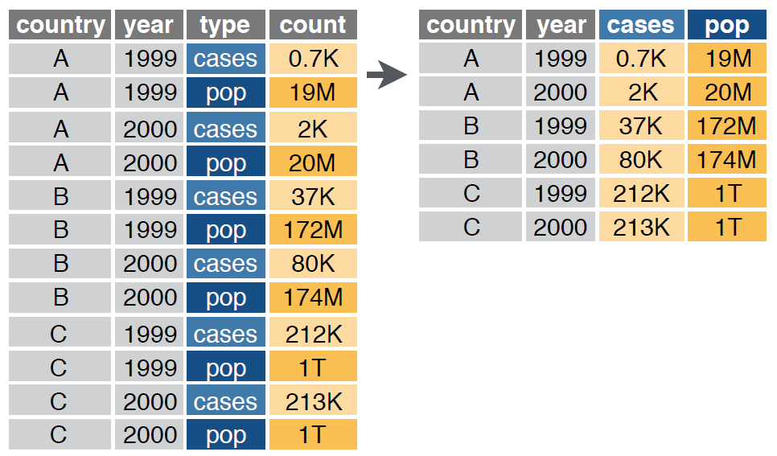
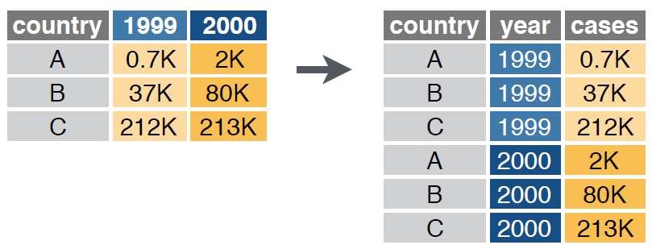

```{r setup, include=FALSE}
knitr::opts_chunk$set(
  echo = TRUE, 
  message = FALSE, 
  warning = FALSE,
  error = FALSE,
  fig.align = 'center',
  out.width='60%')

library(tidyverse)
```

## Antes de empezar

- Dudas
- Preguntas
- Comentarios

## ¿Qué veremos hoy?

- Un poco más de manejo de datos (`dplyr`)
- Transformación de datos (`tidyr`)
- Funciones e iteraciones

```{r, out.width='80%',  echo = FALSE, out.width='750px'}
knitr::include_graphics("Imagenes/ProcesoDS.png")
```

# ifelse/case_when

## `ifelse`

```{r}
(x <- 1:10)
ifelse(x >= 4, 1, 0)
ifelse(x == 5, "A", "B")
```

## Se puede aplicar en `data frames`

```{r}
datosONU_tidy <- read_csv("datos/DatosONU_tidy.csv") %>%
  select(country_name, year) %>% 
  filter(year >= 2004, country_name %in% c("Chile", "Argentina"))

datosONU_tidy %>% 
  mutate(nueva_col = ifelse(year > 2005, 1, 0))
```

## ¿Y si queremos poner más de un valor?

```{r}
datosONU_tidy %>% 
  mutate(nueva_col = ifelse(year > 2005, 1, ifelse(year < 2005, 2, 0)))
```

## `case_when`

```{r}
datosONU_tidy %>% 
  mutate(nueva_col = case_when(
    year > 2005 ~ 1,
    year < 2005 ~ 2,
    TRUE ~ 0
  ))
```

# Transformación de datos

## Tidy data - Datos ordenados

- Cada columna es una variable
- Cada fila es una observación
- Cada celda corresponde a un valor

```{r, out.width='80%',  echo = FALSE, out.width='750px'}
knitr::include_graphics("Imagenes/TidyData.png")
```

## `tidyr`

- `pivot_wider`: transformar "datos largos" a "datos anchos"
- `pivot_longer`: transformar "datos anchos" a "datos largos"
- `separate`: separa columnas
- `unite`: une columnas

Más información en la [web del paquete](https://tidyr.tidyverse.org/articles/pivot.html)

## `tidyr` | Principales funciones (i)

- `pivot_wider`

```{r, out.width='70%',  echo = FALSE}

```

## Pivot_wider {.smaller}

<div style="float: left; width: 45%;">
```{r}
table2
```
</div>

<div style="float: right; width: 45%;">
```{r}
table2 %>% 
  pivot_wider(names_from = type, 
              values_from = count)
```
</div>

## `tidyr` | Principales funciones (ii)

- `pivot_longer`

```{r, out.width='80%',  echo = FALSE}

```

## Pivot_longer {.smaller}

<div style="float: left; width: 45%;">
```{r}
table4a
```
</div>

<div style="float: right; width: 45%;">
```{r}
table4a %>% 
  pivot_longer(2:3, 
               names_to = "year", 
               values_to = "value")
```
</div>

# Demo - Enfermedades respiratorias

## Demo | Script

- `Clase04_TransformacionDatosI.R`

## Enfermedades respiratorias {.smaller}

```{r}
glimpse(who)
```

## Donde comenzamos {.smaller}

```{r, include = FALSE}
tabla_final <- who %>% 
  select(-iso2, -iso3) %>% 
  pivot_longer(-c(country:year), names_to = "variables", values_to = "valores", values_drop_na = TRUE) %>% 
  mutate(variables = str_remove(variables, "new_"),
         variables = str_remove(variables, "new")) %>% 
  separate(variables, into = c("enfermedad", "otro"), sep = "_") %>% 
  separate(otro, into = c("sexo", "edad"), sep =  1) %>% 
  mutate(
    edad = case_when(
      edad == "014" ~ "0-14",
      edad == "1524" ~ "15-24",
      edad == "2534" ~ "25-34",
      edad == "3544" ~ "35-44",
      edad == "4554" ~ "45-54",
      edad == "5564" ~ "55-64",
      edad == "65" ~ "65+"
    ),
    sexo = case_when(
      sexo == "m" ~ "hombres",
      sexo == "f" ~ "mujeres"
    )
  ) %>% 
  filter(year == 2010) %>% 
  group_by(sexo, edad) %>% 
  summarise(total = sum(valores, na.rm = TRUE)) %>% 
  pivot_wider(names_from = edad, values_from = total)
```

```{r}
(enfermedades <- who %>% 
  select(-iso2, -iso3))
```

## Donde queremos llegar {.smaller}

```{r}
tabla_final
```

- ¿Edad?
- ¿Sexo?

## ¿Qué información tenemos disponible? {.smaller}

```{r}
names(enfermedades)
```

- __[*new o new_*]+[*enfermedad*]+[_]+[*sexo*]+[*RangoEdad*]__

## ¿Pivot_ ... longer o wider?

```{r}
enfermedades
```

## ¿Pivot_ ... longer o wider?


## Transformamos la forma de nuestros datos {.smaller}

```{r}
(enfermedades2 <- enfermedades %>% 
  pivot_longer(-c(country:year), 
               names_to = "variables", 
               values_to = "valores"))
```

- Tenemos una columna que contiene tres variables pero también una parte que no nos sirve mucho.

## stringr

```{r, echo=FALSE}
knitr::include_url("https://stringr.tidyverse.org/reference/index.html")
```

## Eliminaremos parte de la columna "variables" que no nos sirve {.smaller}

```{r}
(enfermedades3 <- enfermedades2 %>% 
  mutate(variables = str_remove(variables, "new_"),
         variables = str_remove(variables, "new")))
```

- Ahora tenemos una columna que contiene tres variables. ¿Cómo las separamos?

## `separate` (i) {.smaller}

<div style="float: left; width: 45%;">
```{r}
enfermedades3
```
</div>

<div style="float: right; width: 45%;">
```{r}
(enfermedades4 <- enfermedades3 %>% 
  separate(variables, 
           into = c("enfermedad", "otro"), 
           sep = "_")) 
```
</div>

## `separate` (ii) {.smaller}

<div style="float: left; width: 45%;">
```{r}
enfermedades4
```
</div>

<div style="float: right; width: 45%;">
```{r}
(enfermedades5 <- enfermedades4 %>% 
  separate(otro, 
           into = c("sexo", "edad"), 
           sep =  1))
```
</div>
 
## Se podría llegar a lo mismo usando `stringr` {.smaller}

<div style="float: left; width: 45%;">
```{r, results='hide'}
enfermedades2 %>% 
  transmute(country, year,
            
    enfermedad = case_when(
      str_detect(variables, "rel") ~ 
        str_sub(variables, 4, 6),
      TRUE ~ str_sub(variables, 5,6)),
    
    sexo = case_when(
      str_detect(variables, "m") ~ "m",
      TRUE ~ "f"),
    
    edad = str_extract(variables, "\\d+"),
    valores
    )
```
</div>

<div style="float: right; width: 55%;">
```{r, echo = FALSE}
enfermedades3 %>% 
  transmute(country, year,
    enfermedad = case_when(
      str_detect(variables, "rel") ~ str_sub(variables, 1, 3),
      TRUE ~ str_sub(variables, 1,2)),
    sexo = case_when(
      str_detect(variables, "m") ~ "m",
      TRUE ~ "f"),
    edad = str_extract(variables, "\\d+"),
    valores
    )
```
</div>

## Modificaremos algunos valores para mayor claridad {.smaller}

<div style="float: left; width: 45%;">
```{r, results='hide'}
(enfermedades6 <- enfermedades5 %>% 
  mutate(
    edad = case_when(
      edad == "014" ~ "0-14",
      edad == "1524" ~ "15-24",
      edad == "2534" ~ "25-34",
      edad == "3544" ~ "35-44",
      edad == "4554" ~ "45-54",
      edad == "5564" ~ "55-64",
      edad == "65" ~ "65+"
    ),
    sexo = case_when(
      sexo == "m" ~ "hombres",
      sexo == "f" ~ "mujeres"
    )))
```
</div>

<div style="float: right; width: 55%;">
```{r, echo = FALSE}
(enfermedades6 <- enfermedades5 %>% 
  mutate(
    edad = case_when(
      edad == "014" ~ "0-14",
      edad == "1524" ~ "15-24",
      edad == "2534" ~ "25-34",
      edad == "3544" ~ "35-44",
      edad == "4554" ~ "45-54",
      edad == "5564" ~ "55-64",
      edad == "65" ~ "65+"
    ),
    sexo = case_when(
      sexo == "m" ~ "hombres",
      sexo == "f" ~ "mujeres"
    )))
```
</div>

## Calculamos el total de enfermedades por sexo y rango de edad {.smaller}

```{r}
(resumen_enfermedades <- enfermedades6 %>% 
  filter(year == 2010) %>% 
  group_by(sexo, edad) %>% 
  summarise(total = sum(valores, na.rm = TRUE)))
```

## `Pivot_wider` para dar la forma final a la tabla

```{r}
(tabla_final <- resumen_enfermedades %>% 
  pivot_wider(names_from = edad, values_from = total))
```

## Resumen {.smaller}

```{r, eval = FALSE}
tabla_final <- who %>% 
  # Eliminar columnas que no usaremos
  select(-iso2, -iso3) %>% 
  # Ajustar forma de los datos (de ancho a largo)
  pivot_longer(-c(country:year), names_to = "variables", values_to = "valores", values_drop_na = TRUE) %>% 
  # Extraer información de la columna "variables
  mutate(variables = str_remove(variables, "new_"),
         variables = str_remove(variables, "new")) %>% 
  separate(variables, into = c("enfermedad", "otro"), sep = "_") %>% 
  separate(otro, into = c("sexo", "edad"), sep =  1) %>% 
  # Re-codificar las columnas edad y sexo
  mutate(edad = case_when(
    edad == "014" ~ "0-14",
    edad == "1524" ~ "15-24",
    edad == "2534" ~ "25-34",
    edad == "3544" ~ "35-44",
    edad == "4554" ~ "45-54",
    edad == "5564" ~ "55-64",
    edad == "65" ~ "65+"),
    sexo = case_when(
      sexo == "m" ~ "hombres",
      sexo == "f" ~ "mujeres")) %>% 
  # Generar tabla final para el año 2010
  filter(year == 2010) %>% 
  group_by(sexo, edad) %>% 
  summarise(total = sum(valores, na.rm = TRUE)) %>% 
  pivot_wider(names_from = edad, values_from = total)
```

# Ejercicio

## Ejercicio | Script

- `Clase04_EjercicioI.R`

# Funciones e iteraciones

## Funciones

- Hasta ahora hemos visto funciones que vienen por defecto en `R` o en paquetes que cargamos
- Pero también podemos generar nuestras propias funciones
  * ¿Para qué?
- Si se encuentran con un script que repite muchas veces (¿más de 3?) probablemente sea necesaria una función

## ¿Cómo se crea una función?

- Una función tiene tres partes
  * Nombre
  * Argumentos
  * Cuerpo
  
```{r}
ElevaryDividir <- function(x, y, z){
  (x^y)/z
}

ElevaryDividir(3, 2, 4)
```

## Ejemplo {.smaller}

Estamos explorando datos y queremos ir graficando distintos indicadores para distintos países

```{r, out.width='45%'}
datosONU_tidy <- read_csv("datos/DatosONU_tidy.csv")

datosONU_tidy %>% 
  filter(country_name == "Chile") %>% 
  ggplot(aes(x = year, y = population_total)) +
  geom_point() +
  geom_line() +
  labs(x = NULL) +
  theme_minimal()
```

## Crear una función que haga esto {.smaller}

<div style="float: left; width: 45%;">
```{r, results='hide'}
graf_indicador_pais <- function(x, y){
 
  y <- enquo(y)
  
  datosONU_tidy %>% 
  filter(country_name == x) %>% 
  ggplot(aes(x = year, y = !!y)) +
  geom_point() +
  geom_line() +
  labs(x = NULL) +
  theme_minimal() 
  
}
```
</div>

<div style="float: right; width: 55%;">
```{r, out.width='90%'}
graf_indicador_pais("Chile", population_total)
```
</div>

## Y ahora podemos hacer muchas cosas más {.smaller}

<div style="float: left; width: 47%;">
```{r, out.width='90%'}
graf_indicador_pais("Chile", population_total)
```
</div>

<div style="float: right; width: 50%;">
```{r, out.width='100%'}
graf_indicador_pais("Argentina", 
                    gdp_per_capita_constant_2005_us)
```
</div>


## Iteraciones | ¿Para qué?

Digamos que queremos graficar el mismo indicador para varios países:

```{r, eval=FALSE}
graf_indicador_pais("Chile", gdp_per_capita_constant_2005_us)
graf_indicador_pais("Argentina", gdp_per_capita_constant_2005_us)
graf_indicador_pais("United States", gdp_per_capita_constant_2005_us)
```
## Antes de seguir | Tipos de objetos

```{r, echo = FALSE, out.width='800px'}
knitr::include_graphics("Imagenes/TipoDatos.png")
```


## `for` loops

```{r}
for (i in 1:10){
  print(2^i)
}
```

## `for` loop aplicado a nuestro ejemplo {.smaller}

```{r}
graficos <- list()
paises <- c("Chile", "Argentina", "United States")
for (i in seq_along(paises)){
  graficos[[i]] <- graf_indicador_pais(paises[i], gdp_per_capita_constant_2005_us)
}
```

<div style="float: left; width: 47%;">
```{r, out.width='80%'}
graficos[[1]]
```
</div>

<div style="float: right; width: 50%;">
```{r, out.width='75%'}
graficos[[2]]
```
</div>

## Otra opción | `map` {.smaller}

```{r}
library(purrr)
paises <- c("Chile", "Argentina", "United States")
graficos <- map(paises, graf_indicador_pais, gdp_per_capita_constant_2005_us)
```

<div style="float: left; width: 47%;">
```{r, out.width='80%'}
graficos[[1]]
```
</div>

<div style="float: right; width: 50%;">
```{r, out.width='75%'}
graficos[[2]]
```
</div>

## Funciones `map`

- `map()`: resultado es una lista
- `map_lgl()`: resultado es un vector de valores lógicos
- `map_int()`: resultado es un vector de números integrales
- `map_dbl()`: resultado es un vector de números decimales
- `map_chr()`: resultado es un vector de valores tipo texto

# Ejercicio

## Ejercicio | Script

- `Clase04_EjercicioII.R`

## ¿Qué se viene?

- Próxima clase: regresión vs clasificación
- Tarea 2: sábado 5 de septiembre
- Vayan recopilando sus datos
  * 21 de septiembre: 1ra entrega