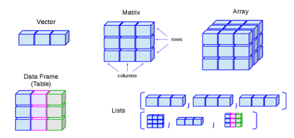

```{r setup, include=FALSE}
options(htmltools.dir.version = FALSE)
library(knitr)
opts_chunk$set(
  fig.align="center",  
  fig.height=4, #fig.width=6,
  # out.width="748px", #out.length="520.75px",
  dpi=300, #fig.path='Figs/',
  cache=T,#, echo=F, warning=F, message=F,
  echo = TRUE,
  message = FALSE,
  warning = FALSE,
  error = FALSE
  )
library(tidyverse)
library(hrbrthemes)
library(fontawesome)
library(tidymodels)
```

# ¿Qué veremos hoy?

- [Regresión](#reg)
- [Clasificación](#clas)

```{r, out.width='80%',  echo = FALSE, out.width='750px'}
knitr::include_graphics("Imagenes/ProcesoDS.png")
```

---

# ¿Por qué?

**Objetivo**: representar la relación entre una variable dependiente $Y$ y una o varias variables explicativas/independientes $X_1, X_2,..., X_k$.

</br>

$$Y = f(X)+\epsilon$$

</br>

--

- Si $Y$ es una variable *continua*: **regresión**
- Si $Y$ es una variable *categórica*: **clasificación**


---

# Inferencia vs Predicción

### Inferencia: 
  * Aprender y concluir algo sobre como se relacionan variables
  * Evitar sesgo
  * *Dentro de muestra*
  * $\hat{f}$ / $\hat{\beta}$ 
--


### Predicción: 
  * Que la predicción esté lo más cerca posible del valor real
  * Evitar sobreajuste al entrenar modelos
  * *Fuera de muestra*
  * $\hat{Y}$
  
--

Algunos algorítmos pueden servir para ambos objetivos pero con diferencias en la implementación (*ej. Regresión lineal para inferencia o para predicción*).

--

**Por ahora no hablaremos de predicción**

---
class: inverse, center, middle
name: reg

# Regresión Lineal

<html><div style='float:left'></div><hr color='#EB811B' size=1px width=796px></html>

---

# Estudiantes/Profesor vs Resultados

```{r, out.width='60%'}
# crear vectores de datos
REP <- c(15, 17, 19, 20, 22, 23.5, 25)
Resultados <- c(680, 640, 670, 660, 630, 660, 635) 

# juntar ambos vectores en un data frame
datos_colegio <- data.frame(REP, Resultados)

ggplot(datos_colegio, aes(REP, Resultados)) +
  geom_point(size = 3) +
  theme_minimal()
```

---

# Una linea que describe esta relación (?) 

$$Resultados_i = 713 - 3*REP_i$$

```{r, out.width='60%'}
ggplot(datos_colegio, aes(REP, Resultados)) +
  geom_point(size = 3) +
  geom_abline(aes(intercept = 713, slope = -3), size = 2, col = "red") +
  theme_minimal()
```

---

# Ahora muchas lineas

$$Resultados_i = ¿? - ¿?*REP_i$$

```{r, out.width='60%'}
curvas <- data.frame(int = sample(713:720, 50, replace = TRUE),
                 pend = -3 + rnorm(50, mean = 0, sd = 0.2))

ggplot(datos_colegio, aes(REP, Resultados)) +
  geom_point(size = 3) +
  geom_abline(aes(intercept = int, slope = pend), data = curvas, alpha = 0.5, col = "grey") +
  theme_minimal()
```

---

# Mínimos Cuadrados Ordinarios

- Dada una verdad: 
$$Y_i = \beta_0 + \beta_1 *X_i + u_i$$

--

- Realizamos una estimación: 
$$y_i = b_0 + b_1 *X_i$$

--

</br>

$$Datos \rightarrow Cálculos \rightarrow Estimación \xrightarrow[]{si\ todo\ sale\ bien} Verdad$$
--

</br>

$$X,Y \rightarrow (X'X)^{-1}X'Y \rightarrow \hat{\beta} \xrightarrow[]{si\ todo\ sale\ bien} \beta$$

</br>
</br>

$\hat{\beta}=b$

---

# Mínimos Cuadrados Ordinarios (cont.)

### Regresión lineal simple

- Modelo a estimar dada la existencia de ciertos datos

$$\hat{y}_i = b_0 + b_1 *X_i$$

--

- ¿Cómo se estiman los parámetros?
  * **objetivo**: *minimizar la suma del cuadrado de los residuales *
  
$$\min_{{b_o},{b_1}}\sum_i^n\hat{u_i}^2 = \min_{{b_o},{b_1}}\sum_i^n(Y_i-\hat{y}_i)^2 = \min_{{b_o},{b_1}}\sum_i^n(Y_i-b_0 + b_1 *X_i)^2$$

--

- Parámetros estimados

$$b_1 = \frac{\sum_{i=1}^n (X_i - \bar{X})(Y_i - \bar{Y})}{\sum_{i=1}^n (X_i - \bar{X})^2}$$
$$b_0 = \bar{Y} - b_1 \bar{X}$$

---

# Representación visual

```{r, out.width='90%',  echo = FALSE}

```

---

# Representación visual (cont)

```{r, echo = FALSE, out.width='100%'}

```

---

# $R^2$ - Coeficiente de determinación

- Suma de cuadrados de la regresión (SCR): 
$$\sum_{i=1}^n (\hat{Y_i}-\bar{Y})^2$$
--

- Suma de cuadrados de los residuales (SCE): 
$$\sum_{i=1}^n \hat{u_i}^2 = \sum_{i=1}^n (Y_i-\hat{Y}_i)^2$$
--

- Suma de cuadrados totales (SCT): 
$$SCR + SCE = \sum(Y_i - \bar{Y})^2$$

--

Teniendo estos valores, el coeficiente de determinación corresponde a:

$$R^2 = \frac{SCR}{SCT} = 1 - \frac{SCE}{SCT}$$

--

Noten que $R^2 \in [0,1]$, con 0 correspondiente a un nulo ajuste y 1 a un ajuste perfecto (todos los puntos sobre la curva estimada)

---

# ¿Cómo se ve esto?

```{r, echo = FALSE, out.width='100%'}
library(patchwork)

set.seed(1)
x <- rnorm(100)
y <- x + rnorm(100, sd = 1000)
data <- data.frame(y, x) 

graf1 <- data %>% 
  ggplot(aes(x, y)) + 
  geom_point() + 
  geom_smooth(method = "lm", se = FALSE) + 
  theme_minimal()

x2 <- rnorm(100)
y2 <- x2 + rnorm(100, sd = 0)
data2 <- data.frame(y2, x2) 

graf2 <- data %>% 
  ggplot(aes(x2, y2)) + 
  geom_point() + 
  geom_smooth(method = "lm", se = FALSE) + 
  theme_minimal()

graf1 + graf2
```

---
class: inverse, center, middle

# Ahora con "datos reales"

<html><div style='float:left'></div><hr color='#EB811B' size=1px width=796px></html>

(Disponibles en el paquete **AER**)

---

# Datos California (USA)

```{r}
library(tidyverse)
library(AER)
data("CASchools")
str(CASchools)
```

---

# Preparar datos

```{r}
(datos_reg <- CASchools %>% 
  rename(ingresos = income) %>%
  transmute(district, school,
            Resultados = (read + math)/2,
            REP = students/teachers,
            ingresos,
            grupo_ingresos = as.factor(ifelse(ingresos >= median(.$ingresos), 1, 0))))
```

---

# Relación entre variables

```{r, out.width='90%'}
datos_reg %>% 
  ggplot(aes(REP, Resultados)) + 
  geom_point() +
  theme_minimal()
```

---

# Graficar la curva de regresión 

La regresión lineal simple a estimar sería $Resultados_i = b_0+b_1*REP_i$

- `ggplot` nos permite graficar esta curva de forma simple con `geom_smooth`
  * `method = lm`: curva representando *linear model*
  * `se = FALSE`: sin intervalo de confianza

.pull-left[
```{r, out.width='40%', eval = FALSE}
datos_reg %>% 
  ggplot(aes(REP, Resultados)) + 
  geom_point() + 
  geom_smooth(method = "lm", se = FALSE, size = 1.5) +
  theme_minimal()
```
]

.pull-right[
```{r, out.width='110%', echo = FALSE}
datos_reg %>% 
  ggplot(aes(REP, Resultados)) + 
  geom_point() + 
  geom_smooth(method = "lm", se = FALSE, size = 1.5) +
  theme_minimal()
```
]


--

</br>

¿Cuáles son los coeficientes? ( $b_0$ , $b_1$)

---

# Estimar coeficientes "a mano"

$$b_1 = \frac{\sum_{i=1}^n (X_i - \bar{X})(Y_i - \bar{Y})}{\sum_{i=1}^n (X_i - \bar{X})^2};\ \ b_0 = \bar{Y} - b_1 \bar{X}$$

--

```{r} 
beta1 <- sum((datos_reg$REP - mean(datos_reg$REP)) * (datos_reg$Resultado - mean(datos_reg$Resultado))) / 
  sum((datos_reg$REP - mean(datos_reg$REP))^2)
beta0 <- mean(datos_reg$Resultados) - (beta1*mean(datos_reg$REP))

round(c(beta0, beta1), 4)
```

--

$$R^2=\frac{\sum_{i=1}^n (\hat{Y_i}-\bar{Y})^2}{\sum(Y_i - \bar{Y})^2}$$

--

```{r}
SCR <- sum(((beta0 + (beta1*datos_reg$REP)) - mean(datos_reg$Resultados))^2)
SCT <- sum((datos_reg$Resultados - mean(datos_reg$Resultados))^2)
R2 <- SCR/SCT
round(R2, 5)
```

---

# Por suerte `R` lo hace más simple

```{r}
modelo1 <- lm(Resultados ~ REP, data = datos_reg)
summary(modelo1)
```

---

# ¿Qué es esto?

```{r}
str(modelo1)
```

---

# Tipos de objetos

</br>

```{r, echo = FALSE, out.width='800px'}

```

---

# Paquete `broom`

```{r}
library(broom)
tidy(modelo1)
glance(modelo1)
```

---

# Paquete `broom` (cont.)

```{r}
augment(modelo1)
```

---

# Regresión Lineal Múltiple

- ¿Es factible que solo `REP` influya en `Resultados`?

--

$$Resultados_i=b_0+b_1REP+b_2A+b_3B+...+b_nZ$$

--

- ¿Qué pasa si no se incluyen otras variables relacionadas?

---

# Paradoja de Simpson

```{r, echo = FALSE, out.width='90%'}
set.seed(1)
x1 <- rnorm(100)
x2 <- rnorm(100) + 1
x3 <- rnorm(100) + 2
y1 <- -x1 + rnorm(100) 
y2 <- -x2 + 4 + rnorm(100) 
y3 <- -x3 + 8 + rnorm(100)
df1 <- data.frame(x = x1, y = y1, cat = as.factor(rep(1,100)))
df2 <- data.frame(x = x2, y = y2, cat = as.factor(rep(2,100)))
df3 <- data.frame(x = x3, y = y3, cat = as.factor(rep(3,100)))
df <- rbind(df1, df2, df3)

simpson1 <- ggplot(df, aes(x = x, y = y)) +
  geom_point() + 
  geom_smooth(method = "lm", se = FALSE, col = "black", size = 1.3) +
  theme_bw() +
  theme(legend.position = "none")

simpson2 <- ggplot(df, aes(x = x, y = y, group = cat, color = cat)) +
  geom_point() + 
  geom_smooth(method = "lm", se = FALSE) +
  theme_bw() +
  theme(legend.position = "none")

(simpson1|simpson2)
```

- Sesgo de variable omitida

---

# Regresión Lieal Múltiploe (cont)

### ¿Cómo se estiman los parámetros?

En forma matricial:

$$Y=X\beta+\epsilon$$

--

```{r, echo = FALSE, out.width='550px'}

```

--

Lo que debemos hacer es estimar el vector de parámetros $\hat{\beta}$ 

$$\hat{\beta}=(X'X)^{-1}X'Y$$

Terminando finalmente con $\hat{Y}=X\hat{\beta}$

---

# Por suerte `R` lo hace más simple

$$Resultados_i=b_0 + b_1 *REP_i + b_2 *ingresos_i$$

```{r}
modelo2 <- lm(Resultados ~ REP + ingresos, data = datos_reg)
summary(modelo2)
```

---

# Comparemos

Comparemos los valores de $R^2$ para `modelo1` (simple) y `modelo2` (múltiple)

--

```{r}
glance(modelo1)$r.squared
glance(modelo2)$r.squared
```

--

- `modelo2` ajusta mejor

--

- Pero **OJO** con el $R^2$: aumentará siempre que sumemos variables

---

# $R^2$ ajustado

$$R^2_{adj}=1-\left( \frac{SCE}{SCT}\frac{n-1}{n-k-1}\right)=1-\left( \frac{\sum_{i=1}^n (Y_i-\hat{Y}_i)^2}{\sum(Y_i - \bar{Y})^2}\frac{n-1}{n-k-1}\right)$$

$n$ es el número de observaciones y $k$ es el número de variables independientes.

--

- Si la nueva variable no "aporta nueva información", $R^2_{adj}$ no aumenta
- Debido a lo anterior, $R^2_{adj}$ suele ser mejor para la comparación entre modelos
  * $R^2_{adj}$ no es la única métrica de comparación
  
--

```{r}
glance(modelo1)$adj.r.squared
glance(modelo2)$adj.r.squared
```

---

# Modelos con interacciones

```{r, out.width='80%'}
(base <- datos_reg %>% 
  ggplot(aes(x = REP, y = Resultados)) +
  geom_point(aes(col = grupo_ingresos)) +
  theme_minimal() +
  theme(legend.position = "none"))
```

---

# Modelos con interacciones (cont.)

$$Resultados_i=b_0 + b_1 REP_i$$

```{r, echo = FALSE}
tidy(lm(Resultados ~ REP, data = datos_reg))
```

```{r, out.width='75%', echo = FALSE}
base +
  geom_smooth(method = "lm", se = FALSE)
```

---

# Modelos con interacciones (cont.)

$$Resultados_i=b_0 + b_1 REP_i + b_21_{med\_ing}$$

```{r, echo = FALSE}
reg_int1 <- lm(Resultados ~ REP + grupo_ingresos, data = datos_reg)
tidy(reg_int1)
```

```{r, out.width='75%', echo = FALSE}
base +
  geom_line(data = filter(augment(reg_int1), grupo_ingresos == 1),
            aes(x = REP, y = .fitted), col = "#00BFC4", size = 1) +
  geom_line(data = filter(augment(reg_int1), grupo_ingresos == 0),
            aes(x = REP, y = .fitted), col = "#F8766D", size = 1)
```

---

# Modelos con interacciones (cont.)

$$Resultados_i=b_0 + b_1 REP_i + b_21_{med\_ing}+b_3(REP_i*1_{med\_ing})$$

```{r, echo = FALSE}
reg_int2 <- lm(Resultados ~ REP*grupo_ingresos, data = datos_reg)
tidy(reg_int2)
```

```{r, out.width='70%', echo = FALSE}
base +
  geom_smooth(aes(col = grupo_ingresos),
              method = "lm", se = FALSE)
```

---

# ¿Con qué modelo nos quedamos?

- Depende...

--

- ¿ $R^2$ ?

- ¿*p-value*?

- ¿Estadístico F?

--

- Queremos estimaciones insesgadas
  * "foco en $\hat{\beta}$"
  * Supuestos de Gauss-Markov

--

</br>

$$Datos \rightarrow Cálculos \rightarrow Estimación \xrightarrow[]{si\ todo\ sale\ bien} Verdad$$
$$X,Y \rightarrow (X'X)^{-1}X'Y \rightarrow \hat{\beta} \xrightarrow[]{si\ todo\ sale\ bien} \beta$$

---

# Idea a retener

- Flexibilidad de un modelo

--

- Más variables $\rightarrow$ Más Flexibilidad

--

- Interacciones $\rightarrow$ Más Flexibilidad

--

- ¿Bueno o Malo?

--

- Sesgo vs Varianza (próxima clase)

---
class: inverse, center, middle
name: clas

# Regresión Logística / Clasificación

<html><div style='float:left'></div><hr color='#EB811B' size=1px width=796px></html>

---

# Variable dependiente binaria

- Hasta ahora consideramos una variable dependiente $Y$ continua (Resultados de prueba)

--

- Pero también podemos tener casos en que $Y$ es una variable categórica/binaria (1 o 0)
  * Otorgamiento de crédito/subsidio
  * Ocurrencia de algún evento/episodio
  * Ingreso a la Universidad
  * ...
  
--

- Esto conlleva algunos desafíos extra a los que hemos visto hasta ahora

---

# Datos de créditos hipotecarios

- Un crédito hipotecario puede ser aprobado o rechazado

--

- Uno de los principales criterios de evaluación es el ratio entre el dividendo y el sueldo

--

```{r}
data(HMDA)
datos_logit <- HMDA %>% 
  select(rechazado = deny, pago_ingreso = pirat) %>% 
  mutate(rechazado = as.numeric(rechazado)-1)
summary(datos_logit)
```

---

# ¿Cómo se ve esto?

```{r, out.width='90%'}
datos_logit %>% 
  ggplot(aes(x = pago_ingreso, y = rechazado)) +
  geom_point() +
  theme_minimal() 
```

Ya no tenemos una dispersión como la que vimos antes

---

# Modelo de probabilidad lineal

¿Qué ocurre si modelamos esto al igual que una regresión con $Y$ continua?

--

$$P(Rechazado=1|pago\_ingreso)=b_0+b_1*pago\_ingresos$$

--

.pull-left[
```{r, out.width='40%', eval = FALSE}
datos_logit %>% 
  ggplot(aes(x = pago_ingreso, y = rechazado)) + 
  geom_point() +
  geom_smooth(method = "lm", se = FALSE) + 
  theme_minimal() 
```
]

.pull-right[
```{r, out.width='110%', echo = FALSE}
datos_logit %>% 
  ggplot(aes(x = pago_ingreso, y = rechazado)) + 
  geom_point() +
  geom_smooth(method = "lm", se = FALSE) + 
  theme_minimal() 
```
]

--

- El modelo permite valores menores a 0 y superiores a 1. ¿Cómo interpretamos eso?

--

- Debemos buscar una forma de limitar los valores de $Y$
  * $P(Rechazado=1|pago\_ingreso)=F(b_0+b_1*pago\_ingresos)$

---

# Modelo logit

- El modelo logit (o logístico) nos permite limitar los valores de $Y$ entre 0 y 1 usando como función auxiliar $F = \frac{exp(z)}{1+exp(z)}$ con $z=b_0+b_1*pago\_ingresos$.

--

</br>

$$P(Rechazado=1|pago\_ingreso)=\frac{e^{(b_0+b_1*pago\_ingresos)}}{1+e^{(b_0+b_1*pago\_ingresos)}}$$
El proceso de estimación es algo distinto a lo que vimos para MCO. En este caso se hace por algo llamado máxima verosimilitud (no entraremos en detalles).

--

#### Pero en R...

```{r}
modelo_logit <- glm(rechazado ~ pago_ingreso, family = "binomial", data = datos_logit)
```

---

# ¿Cómo se ve esto?

```{r, out.width='80%'}
datos_logit %>% 
  ggplot(aes(x = pago_ingreso, y = rechazado)) +
  geom_point() +
  geom_smooth(method = "glm", se = FALSE,
              method.args = list(family = "binomial")) +
  theme_minimal()
```

---

# Interpretar el resultado

```{r}
tidy(modelo_logit)
```

--

$$P(Rechazado=1|pago\_ingreso)=\frac{e^{(-4.03+5.88*pago\_ingresos)}}{1+e^{(-4.03+5.88*pago\_ingresos)}}$$
El efecto del ratio entre dividendo e ingresos en la probabilidad de que el crédito sea rechazado depende del "lugar de la curva" donde estemos (no es lineal).

--

```{r}
predict(modelo_logit,
        newdata = data.frame("pago_ingreso" = c(0.1, 0.3, 0.5, 0.7, 1, 2)),
        type = "response") %>% round(4)
```

---

# Interpretar el resultado (cont)

```{r}
tidy(modelo_logit)
```

#### ¿Y cómo se interpreta $\hat{\beta}$?

--

</br>

$$log\left (\frac{P(Rechazado=1)}{P(Rechazado=0)} \right )=-4.03+5.88*pago\_ingresos$$

---

# ¿Cómo evaluamos este modelo?

### Pseudo- $R^2$

Logit es un ejemplo de modelos de regresión no lineal y es importante destacar que en estos casos una métrica como el $R^2$ no tiene sentido ya que sus supuestos son que las relaciones son lineales.

--

Una alternativa es utilizar una métrica conocida como *pseudo-* $R^2$:

$$pseudo-R^2=1-\frac{ln(f^{max}_{full})}{ln(f^{max}_{nulo})}=1-\frac{devianza}{devianza\ nula}$$

--

```{r}
glance(modelo_logit)
1 - (glance(modelo_logit)$deviance/glance(modelo_logit)$null.deviance)
```

---

# ¿Cómo evaluamos este modelo? (cont)

Por otro lado, ahora tenemos una probabilidad de que el crédito sea rechazado para cada observación

```{r}
augment(modelo_logit, type.predict = "response")
```

--

¿Qué criterio usamos para decidir si se clasifica como rechazado o no?

--

Generalmente se considera **0.5** como punto de corte

---

# ¿Cómo evaluamos este modelo? (cont)

```{r}
estimacion_logit <- augment(modelo_logit, type.predict = "response") %>% 
  transmute(rechazado = as.factor(rechazado), 
            .fitted,
            clasificacion = as.factor(ifelse(.fitted >= 0.5, 1, 0)))
```

```{r}
library(tidymodels)
(matriz_confusion <- conf_mat(estimacion_logit, rechazado, clasificacion)$table)
```

--

```{r, collapse=TRUE}
VP <- matriz_confusion[2,2]
FP <- matriz_confusion[2,1]
VN <- matriz_confusion[1,1]
FN <- matriz_confusion[1,2]

(tasa_VP <- VP/(VP+FN))
(tasa_FP <- FP/(FP+VN))
```

---

# Curva ROC

Pero hasta ahora solo se considera el puntaje de corte **0.5**.

--

La curva ROC (Receiver Operating Characteristic) permite mostrar todo el espacio de posibilidades dependiendo de distintos puntos de cortes y mostrando el *trade-off* entre *beneficios* (verdaderos positivos) y *costos* (falsos positivos)

```{r, out.width='50%',  echo = FALSE}

```

---

# Curva ROC (cont)

</br>

```{r, out.width='95%',  echo = FALSE}

```

---

# Área bajo la curva (AUC)

Una métrica que nos permite resumir parte de toda la información que la curva ROC entrega es el área bajo esta misma o AUC.

```{r, out.width='45%',  echo = FALSE}

```

En nuestro ejemplo:

```{r}
roc_auc(estimacion_logit, rechazado, .fitted)
```

---

# Muy mal clasificador

Nuestro modelo es peor que "tirar una moneda" para asignar la clasificación

```{r, out.width='90%'}
roc_curve(estimacion_logit, rechazado, .fitted) %>%
  autoplot()
```

---

# Explorar el potencial de `R` al modelar

- **DemoMuchasRegresiones.R**

---

# Siguiente clase

- Predicción
- Sesgo vs varianza
- Validación cruzada (*cross-validation*)

**Tarea 2 para el sábado**