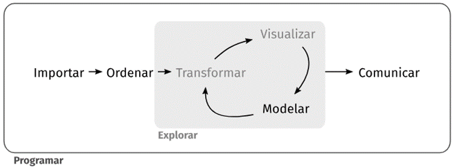
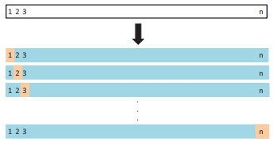
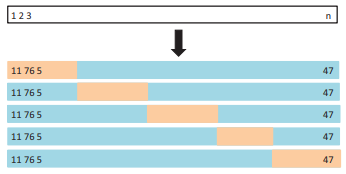

```{r setup, include=FALSE}
library(knitr)
library(hrbrthemes)
library(fontawesome)
library(tidyverse)
library(tidymodels)
library(patchwork)
library(kknn)
library(AER)
library(ISLR)
library(boot)

options(htmltools.dir.version = FALSE)

opts_chunk$set(
  fig.align="center",  
  fig.height=4, #fig.width=6,
  # out.width="748px", #out.length="520.75px",
  dpi=300, #fig.path='Figs/',
  cache=T,#, echo=F, warning=F, message=F,
  echo = TRUE,
  message = FALSE,
  warning = FALSE,
  error = FALSE
  )
```

# Preguntas de la semana pasada

- Correlación vs Coeficiente de regresión ( $\hat{\beta}$)

</br>

- ¿Estandarizar/Normalizar variables?

---

# Correlación vs $\hat{\beta}$

Simularemos dos variables $a$ y $b$:

```{r}
a <- rnorm(100)
b <- 2*a + 2 + rnorm(100, sd = 2)
```

--

La correlación entre ambas variables es:

```{r, collapse=TRUE}
cor(a, b)
cor(b, a)
```

--

Mientras que los coeficientes:

```{r}
lm(b ~ a) %>% tidy() %>% pull(estimate)
lm(a ~ b) %>% tidy() %>% pull(estimate)
```

---

# Correlación vs $\hat{\beta}$ (cont)

Tiene sentido porque...

--

- En el caso de regresión tenemos $b=\hat{\beta_0}+\hat{\beta_1}a$ o bien $a=\hat{\beta_0}+\hat{\beta_1}b$. 

--

Pero sabemos que:

$$\hat{\beta_1} = \frac{cov(x,y)}{\sigma^2(x)}$$

--

</br>

- En cambio, en el caso de correlación;

$$\rho_{x,y} = \frac{cov(x,y)}{\sigma(x)\sigma(y)}$$

---

# Correlación vs $\hat{\beta}$ (cont)

Pero, hay algo que une ambas cosas: $\rho^2=R^2$

--

```{r}
cor(a, b)^2
```

--

```{r}
lm(a ~ b) %>% glance() %>% select(r.squared)
lm(b ~ a) %>% glance() %>% select(r.squared)
```

---

# Estandarizar/Normalizar

```{r}
modelo1 <- lm(mpg ~ cyl + disp + hp, data = mtcars)
modelo1_sc <- lm(mpg ~ scale(cyl) + scale(disp) + scale(hp), data = mtcars)
```

--

```{r}
tidy(modelo1)
tidy(modelo1_sc)
```

---

# Estandarizar/Normalizar (cont)

```{r}
modelo2 <- lm(mpg ~ cyl*disp*hp, data = mtcars)
modelo2_sc <- lm(mpg ~ scale(cyl)*scale(disp)*scale(hp), data = mtcars)
```

--

```{r}
tidy(modelo2) %>% slice(1:4)
tidy(modelo2_sc) %>% slice(1:4)
```

---

# Estandarizar/Normalizar (cont)

Tiene sentido porque...

$$
\begin{aligned}
\sigma^2_{\hat{\beta}_j}&=\frac{\sigma^2_u}{(1-R^2_j)\sum^n_{i=1}(X_{ij}-\bar{X_j})} \\
 & = \frac{1}{n}\frac{\sigma^2_u}{(1-R^2_j)\sigma^2_{X_{j}}}
\end{aligned}
$$

$R^2_j$ es el $R^2$ de una regresión de $X_j$ con respecto a todas las otras $X$

--

La $var(\hat{\beta}_j)$:
- $\uparrow$ con $\sigma^2_u$
- $\downarrow$ con $\sigma^2_{X_j}$
- $\uparrow$ con $R^2_j$

---

# ¿Qué veremos hoy?

- [Introducción a la predicción](#intro_pred)
- [¿Cómo se estima $f$?](#como_estimar)
- [Sesgo vs Varianza](#sesgo_varianza) (*bias-variance trade off*)
- [¿Cómo se predice en la práctica?](#como_predecir)
  * Train/Validation/Test 
  * Validación cruzada (*cross-validation*)

```{r, out.width='80%',  echo = FALSE, out.width='750px'}

```

---
class: inverse, center, middle
name: intro_pred

# Introducción a la Predicción

<html><div style='float:left'></div><hr color='#EB811B' size=1px width=796px></html>

---

# Inferencia vs Predicción

$$Y = f(X)+\epsilon$$

### Inferencia: 
  * Buscar efectos causales de $X$'s en $Y$ y aislar efectos de cada $X$
  * Evitar sesgo
  * $\hat{\beta}$ 

### Predicción: 
  * Agregar eficientemente la señal de todas las $X$'s para obtener la mejor predicción de $Y$
  * No interesa aislar efectos aislados de cada $X$ (*caja negra*)
  * Evitar sobreajuste
  * $\hat{Y}$

--

</br>

**Mejor modelo causal $\neq$ Mejor modelo predictivo**

---

# ¿Por qué?

Si tenemos coeficientes insesgados, ¿por qué estos no nos darían la mejor predicción posible?
  * Predicción fuera de la muestra depende de sesgo y varianza (*bias-variance tradeoff*)
  
--

Según **Shmueli (2010)**, un modelo "mal especificado" genera mejores predicciones cuando:
- los datos tienen mucho "ruido" ( $\sigma$)
- los valores absolutos de los parámetros no considerados ( $\beta_j$) son pequeños
- las variables independientes ( $X$) están muy correlacionadas
- el tamaño de la muestra es pequeño o el número de parámetros no considerados es bajo

--

Según **Srinivasan (1991)**: _Notamos que la práctica en investigación aplicada de concluir que un modelo con mayor poder predictivo es "más verdadero" no es un argumento válido en inferencia. Este trabajo muestra que modelos más simples pero "menos verdaderos" pueden tener mayor poder predictivo_

---

# *Machine learning*

*Machine learning* es básicamente lo mismo que decir predicción

- ¿Inteligencia artificial?
- ¿Deep learning?
- ¿Procesamiento de texto?

--

En cualquier caso siempre podemos simplificar el problema: 

$$\hat{Y} = \hat{f}(X)$$

--

- ¿qué queremos predecir? ( $Y$)
- ¿qué tenemos para predecir? ( $X$'s)
- ¿cómo lo hacemos? ( $f$)

--

</br>

Bajo el concetp de *Machine Learning* podemos usar los datos disponibles para encontrar el óptimo entre sesgo y varianza

---

# ML para políticas públicas

- ¿Puede el ML ser útil para las políticas públicas?

- Los problemas de políticas públicas parecieran más bien ser "causales" (inferencia)
  * ¿Debemos implementar la política "X"?
  * ¿Qué producirá "X"?
  * ¿Qué pasa con o sin "X"?

--

#### Un ejemplo

- Todos los años la policía de USA realiza 12 millones de arrestos

- ¿Dónde debe la gente esperar el respectivo juicio?

- Liberar vs detener
  * La detención previa al juicio en promedio es de 2-3 meses (puede llegar a 12)
  * Cerca de 750.000 personas en las cárceles de USA
  * Consecuencias para los/as detenidos/as
  
---

# El problema del juez

- Decidir si liberar o no

--

- La persona acusada que fue dejada libre puede "portarse mal"
  * No se presenta al juicio
  * Comete otro crimen
  
--

- **El juez está haciendo una predicción al tomar la decisión**

---

# Otros ejemplos

- Horas médicas con especialistas
  * ¿Se presentará o no la persona?
  * Agendar otra persona
  
--

- Calidad del aire
  * ¿Habrá mañana buena/mala calidad del airea?
  * Declarar emergencia o limitar operaciones de industria contaminante

---

# De hecho...

```{r, out.width='80%',  echo = FALSE, out.width='750px'}

```

---

# Dicho todo esto

- Los algoritmos no tienen estándares éticos

- Una idea que se pretende tenga impactos positivos puede no tenerlos
  * ej. "algoritmos racistas"

- Tomar el algoritmo como una ayuda para la decisión 

- No dejar que el algoritmo tome la decisión.

---
class: inverse, center, middle
name: como_estimar

# ¿Cómo se estima f?

<html><div style='float:left'></div><hr color='#EB811B' size=1px width=796px></html>

---

# Métodos paramétricos

- Se supone -a priori- la forma funcional de $f$. 
  * Por ejemplo, *MCO* asume que la relación entre $X$ e $Y$ es lineal. 
  * Simplifica algunas cosas ya que podemos asumir cosas sobre los parámetros.

--

- Teniendo la forma funcional definida, se procede a **estimar** o **entrenar** el modelo usando los datos disponible
  * En el caso de *MCO* se realiza la optimización de minimizar la suma del cuadrado de los residuales
  * Se obtienen los **parámetros** (ej. $\hat{\beta}$)
  
---

# Métodos paramétricos (cont)


```{r, out.width="75%"}
data("CASchools")
p1 <- ggplot(data = CASchools, aes(x = expenditure, y = read)) + geom_point() + 
  geom_smooth(method = "lm", se = FALSE) + theme_bw() 

p2 <- ggplot(data = CASchools, aes(x = income, y = read)) + geom_point() + 
  geom_smooth(method = "lm", se = FALSE, formula = y ~ poly(x, 2)) + theme_bw() 

p1 / p2
```

---

# Métodos no paramétricos

- No se hacen supuestos sobre la forma funcional de $f$

- "Los datos hablan"

- Requieres de $n$ más altos para tratar de captar realmente relaciones con sentido

---

# Métodos no paramétricos (cont)

.pull-left[
```{r, out.width='40%', results = 'hide'}
k1.1 <- kknn(read ~ expenditure, train = CASchools, test = CASchools, k = 1, kernel = "rectangular")
k1.2 <- kknn(read ~ income, train = CASchools, test = CASchools, k = 1, kernel = "rectangular")

pknn1.1 <- ggplot(data = CASchools, aes(x = expenditure, y = math)) +
  geom_line(aes(x = expenditure, y = k1.1$fitted.values), col = "blue") +
  geom_point() +  theme_bw()

pknn1.2 <- ggplot(data = CASchools, aes(x = income, y = read)) +
  geom_line(aes(x = income, y = k1.2$fitted.values), col = "blue") +
  geom_point() + theme_bw()
```

```{r, out.width='40%', results = 'hide'}
k2.1 <- kknn(read ~ expenditure, train = CASchools, test = CASchools, k = 9, kernel = "rectangular")
k2.2 <- kknn(read ~ income, train = CASchools, test = CASchools, k = 9, kernel = "rectangular")

pknn2.1 <- ggplot(data = CASchools, aes(x = expenditure, y = math)) +
  geom_line(aes(x = expenditure, y = k2.1$fitted.values), col = "blue") +
  geom_point() + theme_bw()

pknn2.2 <- ggplot(data = CASchools, aes(x = income, y = read)) +
  geom_line(aes(x = income, y = k2.2$fitted.values), col = "blue") +
  geom_point() + theme_bw()
```
]

.pull-right[
```{r, out.width='115%', echo = FALSE}
pknn1.1 / pknn1.2
```

```{r, out.width='115%', echo = FALSE}
pknn2.1 / pknn2.2
```
]

---
class: inverse, center, middle
name: sesgo_varianza

# Dilema sesgo/varianza

<html><div style='float:left'></div><hr color='#EB811B' size=1px width=796px></html>

---

# Sesgo vs Varianza

Considere una función $Y=f(X)+\epsilon$ estimada para predecir de la siguiente manera $\hat{Y}=\hat{f}(X)$

$$
\begin{aligned}
 E(Y-\hat{Y})^2 = \ &E[Y-\hat{f}(X)]^2  \\
 =\ &Var[Y] + Var[\hat{f}(X)] + E(f(X)-\hat{f}(X))^2 
\end{aligned}
$$

--

</br>

$$
\begin{aligned}
 Error\ Irreducible = \ &Var[Y]  \\
 Componente\ Reducible = \ &Var[\hat{f}(X)] + E(f(X)-\hat{f}(X))^2 \\
\end{aligned}
$$

--

</br>

$$
\begin{aligned}
 Varianza\ del\ modelo=\ &Var[\hat{f}(X)] \\
 Sesgo\ del\ modelo=\ &E(f(X)-\hat{f}(X))^2
\end{aligned}
$$

--

**PROBLEMA**
- Si $\downarrow$ varianza $\uparrow$ sesgo 
- Si $\downarrow$ sesgo $\uparrow$ varianza 

---

# Sesgo vs Varianza (cont)

```{r, out.width="65%"}
set.seed(1)
df <- data.frame()
for (i in 1:10){
  x <- rnorm(1000, 0, 1); e <- rnorm(1000, 0 , 2); y <- -x^2 + e
  df <- rbind(df, data.frame(y, x, n = as.factor(i)))
}

df %>% 
  filter(n == 1) %>% 
  ggplot(aes(x, y)) +
  geom_point(alpha = 0.4) + theme_void()
```

---

# Modelo simple

```{r, out.width="75%"}
df %>% 
  filter(n == 1) %>% 
  ggplot(aes(x, y)) +
  geom_point(alpha = 0.4) +
  theme_void() +
  geom_hline(yintercept = mean(y), col = "red", size = 1.2) 
```

---

# Baja varianza - Alto sesgo

```{r, out.width="75%"}
for (i in 1:10){
  p1 <- df %>% 
    ggplot(aes(x, y, color = n)) +
    geom_point(alpha = 0.1, size = 1.2) + theme_void() + 
    geom_hline(yintercept = mean(pull(filter(df, n == i), y)), col = i, alpha = 0.4)
}

p1 + theme(legend.position = "none")
```

---

# Modelo complejo

```{r, out.width="65%"}
knn <- kknn(y ~ x, filter(df, n == 1), filter(df, n == 1), k = 2 , kernel = "rectangular")
df2 <- cbind(df, knn = knn$fitted.values)

df2 %>% 
  filter(n == 1) %>% 
  ggplot(aes(x, y)) +
  geom_point(alpha = 0.2) +
  geom_line(aes(x, knn), color = "red") +
  theme_void()
```

---

# Bajo sesgo - Alta varianza

```{r, out.width="75%"}
p2 <- df %>% ggplot(aes(x, y, color = n)) + geom_point(alpha = 0.1) + theme_void()
for (i in 1:10){
  knn <- kknn(y ~ x, filter(df, n == i), filter(df, n == i), k = 2 , kernel = "rectangular")
  x_v <- pull(filter(df, n == i), x)
  data <- data.frame(x_v, knn = knn$fitted.values)
  p2 <- p2 + geom_line(aes(x_v, knn), color = i, data = data, alpha = 0.4)
}

p2 + theme(legend.position = "none")
```

---

# Modelo "intermedio"

```{r, out.width="75%"}
df %>% 
  filter(n == 1) %>% 
  ggplot(aes(x, y)) +
  geom_point(alpha = 0.4) +
  geom_smooth(color = "red", se = FALSE, formula = y ~ poly(x, 2)) +
  theme_void()
```

---

# Balance

```{r, out.width="75%"}
p3 <- df %>% ggplot(aes(x, y, color = n)) + geom_point(alpha = 0.1) + theme_void()
for (i in 1:10){
  p3 <- p3 + geom_smooth(color = i, se = FALSE, data = filter(df, n == i), alpha = 0.4)
}

p3 + theme(legend.position = "none")
```

---
class: inverse, center, middle
name: como_predecir

# ¿Cómo se predice en la práctica?

<html><div style='float:left'></div><hr color='#EB811B' size=1px width=796px></html>

---

# Predecir "fuera de muestra"

- Un buen modelo (predictivo) tiene que poder adelantarse a fenómenos que no han ocurrido 
  * ¿Cómo puedo saber que tan bien será un modelo para datos futuros si no tengo esos datos? 

--

- Podemos simular esta situación, por ejemplo:
  * Parte de los datos disponibles se usan para estimar el modelo (*train set*)
  * Parte de los datos disponibles se usan para “jugar el rol de ser observaciones del futuro” (*validation set*)
  
--

- Calcular métricas para evaluar que tan bien un modelo predice y así comparar distintos modelos según esta métrica.

---

# Predecir "fuera de muestra" (cont)

- Observaciones que no se usan para estimar el modelo son clave para equilibrar el sesgo y la varianza

--

- Si solo nos concentramos en ajustar bien los datos de entrenamiento corremos el riesgo de sobreajustar estos

--

- Un grupo de validación que no "ha visto el modelo" permite estimar el error de predicción

--

```{r, out.width='60%',  echo = FALSE}
knitr::include_graphics("Imagenes/mNIed.png")
```

---

# Ejemplo de predicción

```{r}
set.seed(1)
split <- initial_split(data = Auto, prop = 0.7)
auto_train <- training(split)
auto_validation <- testing(split)

c(train= nrow(auto_train), test = nrow(auto_validation))
```

--

Estimaremos 4 modelos de distinta complejidad y analizar cual produce una mejor predicción.

$$
\begin{aligned}
 mpg = &\ b_0+b_1horsepower \\
 mpg = &\ b_0+b_1horsepower+b_2horsepower^2 \\
 mpg = &\ b_0+b_1horsepower+b_2horsepower^2+b_3horsepower^3 \\
 mpg = &\ b_0+b_1horsepower+b_2horsepower^2+b_3horsepower^3+b_4horsepower^4 \\
\end{aligned}
$$

---

# ¿Evaluar dentro de la muestra?

Podemos comparar el $R^2_{adj}$ de los cuatro modelos y ver cual "ajusta" mejor los datos.

--

```{r}
funcion_modelos <- function(x){
  lm(mpg ~ poly(horsepower, x), data = auto_train)
}

modelos <- map(1:4, funcion_modelos)
modelos %>% map(glance) %>% map_dfc(pull, adj.r.squared) %>% round(3)
```

--

- El mejor modelo (con $R^2_{adj}$ más alto) pareciera ser el modelo 4 (*aunque los modelos 2, 3, y 4 dan resultados muy similares*).

--

- Pero esta evaluación es "dentro de muestra" y no necesariamente nos dice cual es el mejor modelo predictivo

---

# Evaluar fuera de muestra

Para evaluar el poder predictivo utilizaremos el **Error Cuadrático Medio** (ECM) o **Mean Squared Error** (MSE) en inglés:

$$ECM=\frac{1}{n}\sum^n_{i=1}(y_i-\hat{f}(x_i))^2$$

--

```{r}
ecm <- function(x){
  mean((auto_validation$mpg - predict(x, auto_validation))^2)
}

map_dfc(modelos, ecm) %>% round(3)
```

--

Ahora resulta que el mejor modelo es el 3, aunque nuevamente da resultados similares al 2 y al 4. Por parsimonia, nos quedaríamos probablemente con el modelo 2

---

# ¿Problema resuelto?

- Tener un grupo de entrenamiento y otro de validación nos permite hacer una estimación del error de predicción 

--

- Pero también presenta algunos problemas

--

- Si no se cuenta con muchos datos para hacer la división entre dos grupos, no habrá suficiente información para entrenar un buen modelo predictivo

--

- Las estimaciones del error pueden ser muy variables dependiendo de cuáles observaciones son incluidas en cada grupo

---

# Train/Validation 10 veces

.pull-left[
```{r, out.width='40%', results = 'hide'}
set.seed(1)
df <- data.frame()
for (i in 1:10){
  split <- initial_split(data = Auto, prop = 0.7)
  auto_train <- training(split)
  auto_validation <- testing(split)
  
  modelos <- map(1:4, funcion_modelos)
  
  x <- map_dfc(modelos, ecm) %>% mutate(samp = as.factor(i))
  
  df <- rbind(df, x)
}
```
]

.pull-right[
```{r, out.width='120%', echo = FALSE}
df %>% 
  pivot_longer(1:4, names_to = "Potencia", values_to = "ECM") %>% 
  mutate(Potencia = as.numeric(str_remove(Potencia, "..."))) %>% 
  ggplot(aes(Potencia, ECM, color = samp)) +
  geom_line() + theme_minimal() + 
  theme(legend.position="none")
```
]

--

- Pareciera que la conclusión hecha anteriormente se mantiene
- Pero también vemos la variabilidad que se genera dependiendo que observaciones caen en cada grupo

---

# Cross-Validation

### Leave-One-Out Cross-Validation (LOOCV)

- La idea general es similar a la ya vista pero ahora el grupo de validación consiste en una sola observación y todo el resto se ocupa para entrenar
- Esto se repite $n$ veces para luego promediar los $n$ errores de predicción obtenidos

--

```{r, out.width='50%',  echo = FALSE}

```

--

$$CV(n)=\frac{1}{n}\sum^n_{i=1}(ECM_i)$$

**Esto nos permite lidiar tanto con el sesgo como la varianza**

---

# LOOCV

```{r, out.width="65%"}
cv.error <- rep(0,4)
for (i in 1:4){
  lm.fit_cv <- glm(mpg ~ poly(horsepower, i) , data = Auto)
  cv.error[i] <- cv.glm(Auto, lm.fit_cv)$delta[1]
}

data.frame(Potencia = 1:4, ECM = cv.error) %>% 
  ggplot(aes(Potencia, ECM)) +
  geom_line() +
  theme_minimal()
```

---

# Cross-Validation (cont)

### K-fold Cross-Validation

- Se dividen las observaciones en $k$ grupos de tamaño similar
- Un grupo de datos se usa como validación mientras que el modelo se estima en los otros $k−1$ grupos
- Este proceso se repite $k$ veces y luego se promedian los $k$ errores de predicción
- Menos intensivo computacionalmente que *LOOCV*

--

```{r, out.width='50%',  echo = FALSE}

```

--

$$CV_k=\frac{1}{k}\sum^k_{i=1}(ECM_i)$$

---

# K-fold Cross-Validation

```{r, out.width="45%"}
set.seed(1)
cv.error.10 <- rep(0,4)
for (i in 1:4){
  lm.fit_cv10 <- glm(mpg ~ poly(horsepower, i) , data = Auto)
  cv.error.10[i] <- cv.glm(Auto, lm.fit_cv10, K = 10)$delta[1]
}

data.frame(Potencia = rep(1:4, 2), 
           ECM = c(cv.error, cv.error.10), 
           CV = c(rep("LOOOCV", 4), rep("K10", 4))) %>% 
  ggplot(aes(Potencia, ECM, color = CV)) +
  geom_line() +
  theme_minimal()
```

---

# Hiperparámetros

- Hasta ahora nuestro único parámetro de complejidad fue dado por la potencia a la que se elevó `horsepower`

--

- Lo visto hasta ahora se puede ampliar a otras decisiones que tomar sobre nuestro modelo

--

- Algunos algoritmos requieren decisiones más allá de que variables incluir

--

- **Hiperparámetros**
  * Próxima clase hablarémos un poco más de esto
  
---

# ¿Qué se viene?

- Tarea 2: sábado 12 Septiembre
- Informe preliminar: Lunes 21 Septiembre
- Tarea 3: sábado 26 Septiembre
- Próxima clase: 
  * Regresiones *stepwise*
  * Regularización de modelos lineales
  * Árboles de decisión 