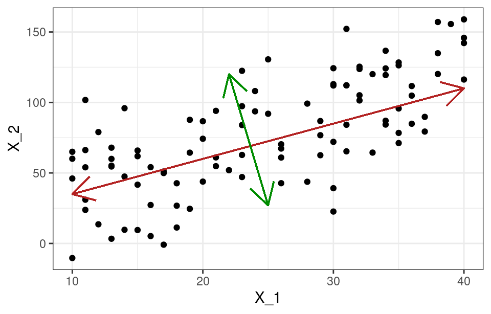

```{r setup, include=FALSE}
library(knitr)
library(hrbrthemes)
library(fontawesome)
library(tidyverse)
library(patchwork)

options(htmltools.dir.version = FALSE)

opts_chunk$set(
  fig.align="center",  
  fig.height=4, #fig.width=6,
  # out.width="748px", #out.length="520.75px",
  dpi=300, #fig.path='Figs/',
  cache=T,#, echo=F, warning=F, message=F,
  echo = TRUE,
  message = FALSE,
  warning = FALSE,
  error = FALSE
  )
```

# Comentario sobre tarea

- **OJO**: `install.packages("...")` una vez
  * `library(...)` en cada nueva sesión de `R`

---

# ¿Qué hemos visto las últimas semanas?

- Regresión y clasificación (inferencia)
  * Dentro de muestra
  
</br>

- Predicción/Machine Learning
  * Fuera de muestra
  
</br>

- Sesgo vs varianza (*bias-variance*)
  * Complejidad/Flexibilidad
  
</br>

- Validación cruzada (*cross-validation*)

---

# ¿Qué NO hemos discutido?

- **¿Qué hacer cuando tenemos muchas variables predictoras ( $X$'s)?**

--

- ¿Cuáles incluir en un modelo y cuáles no?

- ¿Qué criterio usamos para incluir o no una variable?

- ¿Hasta que punto agregamos variables?

---

# ¿Qué veremos hoy?

- [Regresión *stepwise*](#stepwise)
  
</br>

- [Regularización de modelos lineales](#lasso)
  * LASSO
  
</br>

- [Reducción de dimensiones (PCA)](#reg_pca)

---

# Pero antes...

### Estimaciones del error de predicción

#### Ajuste de datos dentro de muestra

- $R^2$
- Devianza

--

#### Error de predicción fuera de muestra

- Estimación directa: set de validación o *cross-validation*
- Estimación indirecta: $C_p$, $AIC$, $BIC$, y $R^2_{adj}$

---

# Estimación indirecta

#### Mallow ( $C_p$):

$$C_p = \frac{1}{n}(SCE+2d\hat{\sigma}^2)$$
  
</br>

#### *Akaike Information Criterion (AIC)*

$$AIC = \frac{1}{n\hat{\sigma}^2}(SCE+2d\hat{\sigma}^2)$$
  
</br>

#### *Bayesian Information Criterion (BIC)*

$$AIC = \frac{1}{n}(SCE+log(n)d\hat{\sigma}^2)$$
  
</br>

$d$ = número de predictores ( $x$'s)

---
class: inverse, center, middle
name: stepwise

# Regresión *stepwise*

<html><div style='float:left'></div><hr color='#EB811B' size=1px width=796px></html>

---

# Mejor *subset*

Dado un número $p$ de variables, se estiman todas las combinaciones posibles de modelos. El algoritmo es el siguiente:

--

1. Estimar modelo nulo ( $M_0$) correspondiente a un modelo sin predictores ( $x$).

--

2. Estimar todos los posibles modelos que contienen **un solo predictor** y seleccionar el con menor SCE o mayor $R^2$. Este modelo se denomina $M_1$.

--

3. Repetir **paso 2** para modelos con dos predictores ( $M_2$) y así sucesivamente hasta llegar al modelo con todos los predictores ( $M_k$, **full model**).

--

4. De todos los modelos seleccionados ( $M_0$, $M_1$, $M_2$, ..., $M_k$) identificar el mejor esta vez usando *cross-validation*, $C_p$, $AIC$, $BIC$, o $R^2_{adj}$.

--

**Limitaciones**:

- Se deben calcular $2^p$ modelos (costo computacional)
- Sobreajuste y varianza: por azar se pueden encontrar buenos resultados (no se recomienda con más de 10 predictores)

---

# Regresión *stepwise*

Computacionalmente más eficiente que "mejor subset". Existen distintos algoritmos: *forward*, *backward*, *hybrid*. El algoritmo del __*forward stepwise*__ corresponde a:

--

1. Estimar modelo nulo ( $M_0$) correspondiente a un modelo sin predictores ( $x$).

--

2. Estimar todos los posibles modelos que contienen **un solo predictor** y seleccionar el con menor SCE o mayor $R^2$. Este modelo se denomina $M_1$. Hasta este punto es exactamente lo mismo que *mejor subset*.

--

3. Estimar todos los posibles modelos que contienen **un predictor más que $M_1$** y seleccionar el con menor SCE o mayor $R^2$. Este modelo se denomina $M_2$. Repetir hasta llegar al modelo con todos los predictores ( $M_k$).

--

4. De todos los modelos seleccionados ( $M_0$, $M_1$, $M_2$, ..., $M_k$) identificar el mejor esta vez usando *cross-validation*, $C_p$, $AIC$, $BIC$, o $R^2_{adj}$.

--

**Limitaciones**:

- No se prueban todos los modelos por lo que puede no obtener *el mejor posible*
- Sin embargo, modelos obtenidos suelen cumplir el objetivo de evitar el *sobreajuste* y tiene buen redimiento computacional.

---

# *Backward* e *Hybrid stepwise regression*

#### *Backward*

- Se comienza desde el modelo $M_k$ (*full model*) y no de $M_0$. 

- Se generan todos los modelos posibles eliminando una variable ( $M_{k-1}$) y se selecciona el con menor SCE o mayor $R^2$.

- Se repite el procedimiento hasta llegar al *modelo nulo* ( $M_0$) y se identifica el mejor de todos esta vez usando *cross-validation*, $C_p$, $AIC$, $BIC$, o $R^2_{adj}$

--

#### *Hybrid*

- Comienza de forma similar al *forward* pero tras cada nueva incorporación se hace una prueba de extracción de variables

- Aproxima más a *mejor subset* pero sigue siendo más eficiente a nivel computacional

---

# *Forward stepwise* en R 

```{r}
library(ISLR)
glimpse(Hitters)
```

---

# *Forward stepwise* en R (cont)

```{r}
library(leaps)
mejores_modelos_forward <- regsubsets(Salary~., data = Hitters, nvmax = ncol(Hitters)-1,
                                      method = "forward")
summary(mejores_modelos_forward)$which
```

---

# *Forward stepwise* en R (cont)

```{r}
summary(mejores_modelos_forward) %>% names
```

.pull-left[

```{r, results='hide'}
resumen_forward <- summary(mejores_modelos_forward)

graf_metricas <- function(x){
  data.frame(n_predictores = 1:19,
             metrica = resumen_forward[[x]]) %>% 
  ggplot(aes(x = n_predictores, y = metrica)) +
  geom_line() +
  geom_point() +
  scale_x_continuous(breaks = c(0:19)) +
  theme_minimal() +
  labs(x = NULL, y = NULL, title = x)
}

graf_forward <- map(names(resumen_forward)[4:6], graf_metricas)
```

]

.pull-right[

```{r, echo = FALSE, fig.height=6.5}
graf_forward[[1]] / graf_forward[[2]] / graf_forward[[3]]
```

]

---

# *Forward stepwise* en R (cont)

```{r}
coef(object = mejores_modelos_forward, 
     id = which.min(resumen_forward$bic))
```

--

#### ¿*stepwise* para inferencia?

--

  - **Ojo**: inferencia es más que definir una métrica y encontrar el mejor modelo según esta
  - Puede ser que *stepwise* deje afuera variables que teóricamente tienen sentido


---
class: inverse, center, middle
name: lasso

# Regularización de modelos lineales

<html><div style='float:left'></div><hr color='#EB811B' size=1px width=796px></html>

---

# Métodos de regularización

- Métodos de *subset* usan un subconjunto de las variables disponibles
  * Cada modelo se estima a través de MCO

--

- Métodos de regularización se estiman con todas las variables disponibles
  * Estimación es similar a MCO pero se agrega un componente que fuerza los coeficientes hacia cero

--

- Los métodos de regularización más usados son *LASSO* y *Ridge*
  * Nos concentraremos en *LASSO* (*Least Absolute Shrinkage and Selection Operator*)

---

# MCO vs LASSO

### Optimización MCO

$$\min_{\beta_j}\sum^n_{i=1}(y_i-\hat{\beta_0}-\sum^p_{j=1}\hat{\beta_j}x_{ij})^2$$
$$\min_{\beta_j}SCE$$

--

### Optimización LASSO

$$\min_{\beta_j}\sum^n_{i=1}(y_i-\hat{\beta_0}-\sum^p_{j=1}\hat{\beta_j}x_{ij})^2+\lambda\sum^p_{j=1}|\beta_j|$$
$$\min_{\beta_j}SCE+\lambda\sum^p_{j=1}|\beta_j|$$

--

- $|\beta_j|$ se conoce como *regularización L1*
- Al reemplazar *L1* por $\beta_j^2$ (*L2*) obtenemos la regularización **ridge**
- *LASSO* fuerza los coeficientes a cero (Selección de variables)

---

# LASSO

$$\min_{\beta_j}\sum^n_{i=1}(y_i-\hat{\beta_0}-\sum^p_{j=1}\hat{\beta_j}x_{ij})^2+\lambda\sum^p_{j=1}|\beta_j|$$


- Si $\lambda=0$, *LASSO* es equivalente a MCO
- Si $\lambda=\infty$, todos los coeficientes ( $\beta$) son igual a cero y obtenemos el *modelo nulo*
- Existe un set de coeficientes, $\hat{\beta}$, para cada valor de $\lambda$

--

- $\lambda$ nos permite "jugar" con el dilema *sesgo-varianza*

- **¿pero cómo elegir el valor de $\lambda$?**

--

- *Cross-validation*

---

# LASSO en R

```{r, out.width="75%"}
library(glmnet)

datos <- Hitters %>% filter(!is.na(Salary))

x <- model.matrix(Salary~., data = datos)[,-1]
y <- datos %>% pull(Salary)

modelos_lasso <- glmnet(x = x, y = y, alpha = 1)
plot(modelos_lasso, xvar = "lambda", label = TRUE)
```

---

# LASSO en R (cont)

```{r, out.width="65%"}
set.seed(1)
cv_error_lasso <- cv.glmnet(x = x, y = y, alpha = 1, nfolds = 10)
plot(cv_error_lasso)
```

```{r}
c("min" = cv_error_lasso$lambda.min,
  "1se" = cv_error_lasso$lambda.1se)
```

---

# LASSO en R (cont)

.pull-left[

```{r, results='hide'}
modelo_final_lasso <- glmnet(x = x, 
                             y = y, 
                             alpha = 1, 
                             lambda = cv_error_lasso$lambda.1se)
coef(modelo_final_lasso)
```

**El modelo solo deja 6 coeficientes (más el intercepto), todos los demás son "forzados" hacia 0**

]

.pull-right[

```{r, echo = FALSE, fig.height=6.5}
coef(modelo_final_lasso)
```

]

---

# ¿LASSO para inferencia?

- $\lambda$ -por construcción- nos introduce sesgo en los $\hat{\beta}$

--

- Existe una corrección que se ha descrito hace relativamente poco tiempo (2006) que podría corregir esto

--

- *Adaptive LASSO*: se introduce una "penalidad" diferenciada a cada coeficiente y esto permitiría corregir el sesgo
  * *Oracle property*

---
class: inverse, center, middle
name: reg_pca

# Reducción de dimensiones

<html><div style='float:left'></div><hr color='#EB811B' size=1px width=796px></html>

---

# Análisis de Componentes Principales

- $p$ variables ( $X_1,X_2, ...,X_p$)

- *PCA* nos permite encontrar $z<p$ variables que explican aproximadamente lo mismo que $p$

- Cada $z$ se denomina un **componente principal**

- "Concentramos" la información de $p$ en $z$

--

- **TODOS LOS** $z$ **SON ORTOGONALES** (no están correlacionados)

--

Álgebra lineal de nuevo: *eigenvectors* y *eigenvalues*

--

__El análisis de componentes principales corresponde a lo conocido como *aprendizaje no supervisado (próxima clase)*__ pero tiene usos en algoritmos supervisados también.

---

# Interpretación geométrica

```{r, echo = FALSE, out.width='550px'}

```

--

- La linea roja corresponde al **primer componente principal**, $Z_1$

- La linea verde corresponde al **segundo componente principal**, $Z_2$

- La proyección de los puntos en cada componente corresponde a los *principal component scores*, $z_{1i}$ y $z_{2i}$

---

# ¿Qué está pasando?

Cada componente principal ( $Z_j$) es una combinación lineal de las variables originales

--

Por ejemplo, la primera componente principal es la combinación lineal normalizada que captura la mayor varianza:

$$Z_1=\phi_{11}X_1+\phi_{12}X_2+...+\phi_{1p}X_p$$

$$\sum_{j=1}^p\phi_{j1}^2=1$$

--

Los términos $\phi$ se conocen como *loadings* y su conjunto definen a cada componente principal. Se pueden interpretar como el peso/importancia de cada variable en el componente

--

Pasos:
- Centralizar las variables (PCA depende de varianza de cada variable)
- Buscar $Z_1$ a través de optimización para encontrar *loadings* que maximizan varianza (*eigenvector-eigenvalue*)
- Se repite el procedimiento para encontrar $Z_2$ sumando la restricción de que $Z_1$ y $Z_2$ no pueden estar correlacionados (ortogonales o perpendiculares)
- Se repite hasta encontrar $p$ componentes principales (o $n-1$)

---

# Principal Component Regression

Calculas los componentes principales es un algoritmo no supervisado. Sin embargo, podemos estimar un modelo utilizando componentes principales como $X$'s y no las variables originales (supervisado).

Ventaja es que nos libramos de cualquier correlación existente entre variables

Desventaja es que perdemos interpretabilidad

---

# PCA en R

```{r}
library(pls)
pca <- x %>% 
  prcomp(scale = TRUE)

summary(pca)
```

---

# PCA en R (cont)

```{r, out.width='75%'}
prop_varianza <- cumsum(pca$sdev^2 / sum(pca$sdev^2))

data.frame(n_componentes = 1:19,
           varianza = prop_varianza) %>% 
  ggplot(aes(x = n_componentes, y = varianza)) +
  geom_line() +
  geom_point() +
  theme_minimal() + scale_x_continuous(breaks = 0:19)
```

---
class: inverse, center, middle
name: comparar

# Comparar métodos

<html><div style='float:left'></div><hr color='#EB811B' size=1px width=796px></html>

---

# Métodos a comparar y datos

.pull-left[

- MCO
- *Forward stepwise*

]

.pull-right[

- *LASSO*
- *Principal Component Regression*

]

```{r}
library(faraway)
names(meatspec)
summary(meatspec$fat)
```

---

# Preparar los datos

```{r}
library(tidymodels)
set.seed(1)
split <- initial_split(data = meatspec, prop = 0.8)
datos_train <- training(split)
datos_test <- testing(split)

dim(datos_train)
dim(datos_test)
```

---

# MCO

```{r}
modelo_mco <- lm(fat ~ ., data = datos_train)
glance(modelo_mco)$adj.r.squared
```

--

```{r}
tidy(modelo_mco) %>% 
  filter(abs(statistic) >= 1.96) %>% 
  pull(term)
```

--

```{r}
(ecm_mco_train <- mean((modelo_mco$fitted.values - datos_train$fat)^2))
(ecm_mco_test <- mean((predict(modelo_mco, newdata = datos_test) - datos_test$fat)^2))
```

---

# *Forward stepwise*

.pull-left[

```{r}
datos_train_cv <- datos_train %>% 
  mutate(g = rep(1:10, length.out = nrow(datos_train)))

predict.forward  <- function(object, newdata, id, ...){
    form <- as.formula(object$call[[2]])
    mat <- model.matrix(form, newdata)
    coefi <- coef(object , id = id)
    xvars <- names(coefi)
    mat[ , xvars] %*% coefi
}

error_matrix <- matrix(data = NA, nrow = 10, ncol = 100,
                       dimnames = list(NULL, c(1:100)))

```

]

.pull-right[

```{r}
for (k in 1:10) {
    train <- datos_train_cv %>% filter(g != k)
    mejores_modelos <- regsubsets(fat ~ ., 
                                  data = train, 
                                  nvmax = 100,
                                  method = "forward")
    
    for (i in 1:100) {
        test <- datos_train_cv %>% filter(g == k)
        predicciones <- predict.forward(object = mejores_modelos,
                                           newdata = test, id = i)
        error_matrix[k,i] <- mean((test$fat - predicciones)^2)
        }
}

mean_cv_error <- apply(X = error_matrix, MARGIN = 2, FUN = mean)
```

]

---

# *Forward stepwise* (cont)

```{r}
(mejor_modelo <- error_matrix %>% 
  as_tibble() %>% 
  summarise_all(mean) %>% 
  which.min())

modelo_final <- regsubsets(fat ~ ., data = datos_train, nvmax = 100,
                           method = "forward")
coef(object = modelo_final, mejor_modelo)
```

```{r}
(ecm_forward_test <- mean((predict.forward(modelo_final, datos_test, id = mejor_modelo) - datos_test$fat)^2))
```

---

# LASSO

```{r}
set.seed(1)

datos_train_x <- model.matrix(fat~., data = datos_train)[,-1]
datos_train_y <- datos_train %>% pull(fat)
datos_test_x <- model.matrix(fat~., data = datos_test)[,-1]
datos_test_y <- datos_test %>% pull(fat)

cv_error_lasso <- cv.glmnet(x = datos_train_x, y = datos_train_y, alpha = 1,
                            nfolds = 10,
                            type.measure = "mse")

modelo_lasso <- glmnet(x = datos_train_x, y = datos_train_y, alpha = 1,
                        lambda = cv_error_lasso$lambda.1se)

predicciones <- predict(object = modelo_lasso, newx = datos_test_x,
                      s = cv_error_lasso$lambda.1se, exact = TRUE)

(ecm_lasso_test <- mean((predicciones - datos_test_y)^2))
```

---

# PCA

```{r}
pca <- datos_train %>% prcomp(scale = TRUE)
summary(pca)$importance[, 1:15]
```

---

# PCA (cont)

```{r}
set.seed(1)
modelo_pcr <- pcr(formula = fat ~ ., data = datos_train, 
                  scale. = TRUE, validation = "CV")
validationplot(modelo_pcr, val.type = "MSE")
```

---

# PCA (cont)

```{r}
modelo_pcr$validation$PRESS %>% which.min()

(ecm_pcr_test <- mean((predict(modelo_pcr, newdata = datos_test, 
                                  ncomp = 20) - datos_test$fat)^2))
```

---

# Comparación

```{r, out.width="75%"}
data.frame(Error = c(ecm_mco_test, ecm_forward_test, ecm_lasso_test, ecm_pcr_test),
           Modelo = c("MCO", "Forward", "LASSO", "PCR")) %>% 
  ggplot(aes(x = reorder(Modelo, -Error), y = Error)) + 
  geom_col() +
  labs(x = NULL)
```

---

# Mensajes importantes

- Inferencia vs predicción

- Probar distintos algoritmos

- Train/Test/CV

---

# Siguientes clases

- Aprendizaje no supervisado

- Árboles de decisión
