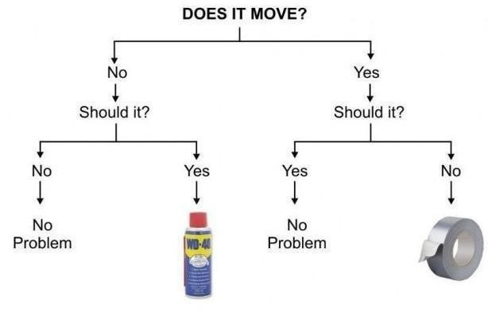
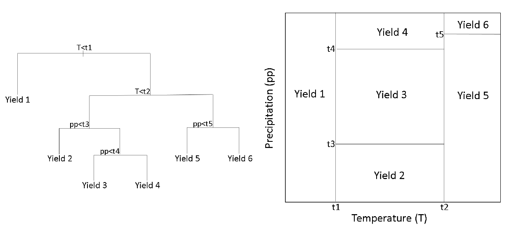
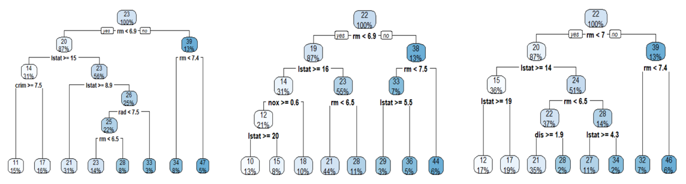

```{r setup, include=FALSE}
library(knitr)
library(hrbrthemes)
library(fontawesome)
library(tidyverse)
library(patchwork)

options(htmltools.dir.version = FALSE)

opts_chunk$set(
  fig.align="center",  
  fig.height=4, #fig.width=6,
  # out.width="748px", #out.length="520.75px",
  dpi=300, #fig.path='Figs/',
  cache=T,#, echo=F, warning=F, message=F,
  echo = TRUE,
  message = FALSE,
  warning = FALSE,
  error = FALSE
  )
```

# ¿Qué veremos hoy?

- [Árboles de decisión](#arbol)
  
- [Clustering](#clust)
  * *k-means*

---
class: inverse, center, middle
name: arbol

# Árboles de decisión

<html><div style='float:left'></div><hr color='#EB811B' size=1px width=796px></html>

---

# Los han visto antes

```{r, out.width='90%',  echo = FALSE}

```

---

# ¿Cómo funcionan?

- Existen muchas metodologías para generar árboles
  * La más diseminada se conoce como el algoritmo de CART (Breiman, 1984)

--

- Separar los datos en subgrupos y asignar una constante a cada observación dentro de estos

--

- Los subgrupos se generan a través de divisiones binarias sucesivas (división recursiva) en base a las variables disponibles

--

- La constante a asignar corresponde al promedio de los valores dentro de cada subgrupo

--

**Se pueden usar tanto para regresión como para clasificación**

---

# Descripción gráfica

```{r, out.width='100%',  echo = FALSE}

```

### Terminología

- Cada resultado (*Yield X*) es un **nodo terminal u hoja**
- Cada división es un **nodo interno**
- Los segmentos que conectan cada nodo son las **ramas**

---

# ¿Cómo definir los subgrupos/áreas?

- Las divisiones se realizan de forma *top-down*
  * Una división generada no cambiará según las siguientes divisiones

--

- Se comienza con todos los datos y se busca el valor que permite separar en $R_1$ y $R_2$ buscando minimizar la suma de cuadrados residuales

$$min\{SCE=\sum_{i\in R_1}(y_i - c_1)^2 + \sum_{i \in R_2}(y_i - c_2)^2\}$$

--

- Se repite el procedimiento en cada una de las regiones generadas y así sucesivamente hasta que se cumpla algún criterio de término

--

- Si no se restringe, el algoritmo genera árboles muy complejos que tenderán a sobreajustar los datos (buen ajuste dentro de muestra pero malas predicción fuera de muestra).

---

# Ejemplos 

```{r, echo = FALSE, out.width="110%"}

```

- Las divisiones son similares en la parte superior pero comienzan a diferenciarse (bastante) al ir bajando hasta las hojas
- Los nodos "más profundos" tienden a sobreajustar los datos
  * Cambios en las muestras generan resultados muy variables en las estimaciones/predicciones
- Los árboles se pueden "podar" para mejorar la predicción (introducir sesgo para mejorar predicción)

---

# Criterio de costo de complejidad

- Para encontrar el mejor árbol de decisión (en términos predictivos), lo que se puede hacer es generar un primer árbol muy grande o complejo y luego podarlo hasta encontrar el punto óptimo de complejidad.

--

- Esto lo podemos implementar usando un parámetro de *costo de complejidad* ( $\alpha$) penalizando el número de nodos ( $T$) en en un árbol.

$$min\{ SCE+\alpha|T|\}$$

--

- Para un valor de $\alpha$ encontramos el árbol podado más pequeño con el error penalizado más bajo.

--

- La penalización debería recordarles algo de lo visto con **LASSO**
  * menores valores de $\alpha$ producen modelos más complejos (árboles más grandes)
  * mayores valores de $\alpha$ producen modelos más simples (árboles más pequeños)
  
--

- ¿Cómo encontrar $\alpha$? $\rightarrow$ **cross-validation**

---

# Ventajas y desventajas

.pull-left[

### Ventajas

- Alta interpretabilidad
- Fácil entender que variables son más importantes
- Rápido para realizar predicciones (algoritmo no es complejo)
- Puede adaptarse a problemas no lineales 

]

--

.pull-right[

### Desventajas

- Árboles individuales presentan alta varianza 
- Por ende, no suelen tener buen rendimiento de predicción

]

--

**Existen formas de usar árboles y lidiar con las desventajas**

---

# Árboles de decisión en R

```{r}
library(tidyverse) # manejo de datos
library(rpart) # árboles de decisión
library(rpart.plot) # gráficos de árboles de decisión
library(AmesHousing) # datos
library(rsample) # construcción de train/test 

datos_casas <- make_ames()
dim(datos_casas)
```

```{r}
set.seed(123)
split <- initial_split(datos_casas , prop = .7)
datos_train <- training(split)
datos_test  <- testing(split)
```

```{r}
dim(datos_train)
dim(datos_test)
```


---

# Árboles de decisión en R (cont)

```{r}
m1 <- rpart(
  formula = Sale_Price ~ .,
  data    = datos_train,
  method  = "anova") # "class" para clasificación

str(m1)
```

---

# Árboles de decisión en R (cont)

```{r}
m1
```

---

# Árboles de decisión en R (cont)

```{r}
rpart.plot(m1)
```

`rpart.plot` tiene distintas opciones para mejorar la visualización (`?rpart.plot`)

---

# Árboles de decisión en R (cont)

- `rpart` está automáticamente aplicando valores de costo de complejidad, $\alpha$, para podar el árbol
  * por defecto usa *10-fold cross validation*

.pull-left[

```{r}
plotcp(m1)
```

]

.pull-right[

- El eje y corresponde al error de predicción obtenido por *cross validation*
- El eje x inferior (**cp**) corresponde al costo de complejidad
- El eje x superior corresponde al número de nodos terminales u hojas

]

---

# Árboles de decisión en R (cont)

```{r}
m1$cptable
```

---

# Árboles de decisión en R (cont)

Además del costo de complejidad, $\alpha$, otros hiperparámetros a ajustar son:

- `minsplit`: número mínimo de observaciones requeridas para realizar una división. Por defecto es 20.
- `maxdepth`: número máximo de nodos internos entre el nodo inicial y las hojas. Por defecto es 30.

Con `rpart`  podemos usar el argumento `control` para indicar valores de hiperparámetros.

.pull-left[
```{r}
m3 <- rpart(
    formula = Sale_Price ~ .,
    data    = datos_train,
    method  = "anova", 
    control = list(minsplit = 10, 
                   maxdepth = 2))
```
]

.pull-right[

```{r, echo = FALSE}
rpart.plot(m3)
```

]

---

# Árboles de decisión en R (cont)

.pull-left[

Para ver la combinación ideal de hiperparámetros podemos generar una "grilla de búsqueda".

```{r}
hiper_grid <- expand.grid(
  minsplit = seq(5, 20, 1),
  maxdepth = seq(8, 15, 1)
)

head(hiper_grid)
nrow(hiper_grid)
```

]

--

.pull-right[

Podemos luego implementar un *loop* para entrenar los modelos usando las distintas combinaciones de la grilla (`hiper_grid`).

```{r loop}
modelos <- list()

for (i in 1:nrow(hiper_grid)) {
  
  # definir hiperparametros de la iteración
  minsplit <- hiper_grid$minsplit[i]
  maxdepth <- hiper_grid$maxdepth[i]

  # entrenar modelos y guardar en la lista
  modelos[[i]] <- rpart(
    formula = Sale_Price ~ .,
    data    = datos_train,
    method  = "anova",
    control = list(minsplit = minsplit, 
                   maxdepth = maxdepth)
    )
}
```

]

---

# Árboles de decisión en R (cont)

Ahora generaremos una función para extraer el valor óptimo de $\alpha$ para cada modelo generado y su correspondiente error.

.pull-left[
```{r}
# función para obtener el valor óptimo de cp
obtener_cp <- function(x) {
  min    <- which.min(x$cptable[, "xerror"])
  cp <- x$cptable[min, "CP"] 
}

# función para obtener el valor de error asociado
obtener_min_error <- function(x) {
  min    <- which.min(x$cptable[, "xerror"])
  xerror <- x$cptable[min, "xerror"] 
}
```
]

.pull-right[
```{r}
(mejores_valores <- hiper_grid %>%
  mutate(
    cp    = map_dbl(modelos, obtener_cp),
    error = map_dbl(modelos, obtener_min_error)
    ) %>%
  arrange(error) %>%
  slice(1))
```
]

---

# Árboles de decisión en R (cont)

```{r}
arbol_optimo <- rpart(
    formula = Sale_Price ~ .,
    data    = datos_train,
    method  = "anova",
    control = list(minsplit = mejores_valores$minsplit, 
                   maxdepth = mejores_valores$maxdepth, 
                   cp = 0.01)
    )

pred <- predict(arbol_optimo, newdata = datos_test)
sqrt(mean((pred - datos_test$Sale_Price)^2))
```

```{r}
summary(datos_casas$Sale_Price)
```

---

# Extensiones de los árboles de decisión

- Árboles individuales suelen tener alta varianza (problema a la hora de predecir)

- Extensiones posibles:
  * __*Bagging*__: promediar distintos árboles individuales que son entrenados en subconjuntos de las observaciones generados por *bootstrap*
  * __*Random Forest*__: además de realizar muestras por *bootstrap* los distintos árboles se estiman con subconjuntos aleatorios de las variables disponibles
  * __*Boosting*__: se "ensamblan" secuencialmente distintos árboles pequeños que van aprendiendo del árbol anterior
  
---
class: inverse, center, middle
name: clust

# Clustering

<html><div style='float:left'></div><hr color='#EB811B' size=1px width=796px></html>

---

# ¿Qué es el *clustering*?

- Es un tipo de análisis que divide las observaciones en grupos que comparten características similares

- La idea es la siguiente, generar grupos donde:
  * las observaciones dentro de un grupo sean similares
  * los grupos sean lo más distintos posibles
  
--

- Existen distintos tipos de *clustering*
  * **k-means**
  * k-medoids (PAM)
  * jerárquico
  * basado en modelo
  * basado en densidad
  * y más

---

# ¿Cómo funciona?

- Los algoritmos de *clustering* usan alguna medida de distancia entre las observaciones para asignar a grupos

- Las medidas de distancia más usadas son:

#### Distancia Euclidiana

$$d_{euc}(x,y)=\sqrt{\sum_{i=1}^n(x_i-y_i)^2}$$

#### Distancia Manhattan

$$d_{man}(x,y)=\sum_{i=1}^n|(x_i-y_i)|$$

- Otros tipos de medidas de distancia:
  * Pearson
  * Spearman
  * Kendall

---

# *k-means clustering*

- *k-means* es el de los algoritmos no supervisados más utilizados

- Permite separar un *data set* en $k$ grupos (o *clusters*)
  * $k$ se define *a priori*

--

### Idea general

- Definir *clusters* que permitan minimizar la variación total *__intra-cluster__*
- Existen distintos algoritmos de *k-means*
  * El más utilizado es el algoritmo de Hartigan-Wong (1979)
  
$$W(C_k)=\sum_{x_i \in C_k}(x_i-\mu_k)^2$$

donde $x_i$ es un dato perteneciente al *cluster* $C_k$ y $\mu_k$ es el promedio de los puntos asignados al *cluster* $C_k$.

---

# *k-means clustering* (cont)

Cada observación, $x_i$, se asigna a un *cluster* con el objetivo de minimizar la suma del cuadrado de la distancia entre las observaciones y el centro de su *cluster*, $\mu_k$

$$min \sum_{k=1}^kW(C_k)=\sum_{k=1}^k\sum_{x_i \in C_k}(x_i-\mu_k)^2$$

#### Algoritmo *k-means*

1. Definir el número de *cluster*, $k$, a construir
2. Seleccionar aleatoriamente $k$ observaciones como los centros iniciales de cada *cluster*
3. Asignar cada observación a su centro más cercano (según distancia Euclidiana)
4. Para cada *cluster*, modificar el centro calculando el nuevo promedio según los datos asignados
5. Iteratívamente minimizar la varianza dentro de los *cluster*. Osea, repetir los pasos **3** y **4** hasta que los *cluster* no cambien o bien hasta alcanzar el máximo de iteraciones definido (10 en el caso de `R`).

---

# k-means en R

```{r}
summary(USArrests)

df <- USArrests %>% 
  mutate(across(where(is.numeric), scale))

rownames(df) <- rownames(USArrests)

summary(df)
```

---

# k-means en R (cont)

```{r}
kmean2 <- kmeans(df, centers = 2)
str(kmean2)
```

---

# k-means en R (cont)

```{r}
kmean2
```

---

# k-means en R (cont)

.pull-left[
```{r}
library(factoextra)
fviz_cluster(kmean2, data = df)
```
]

.pull-right[
```{r}
df_pca <- prcomp(df)

df %>%
  bind_cols(as_tibble(df_pca$x)) %>% 
  mutate(cluster = as.factor(kmean2$cluster),
         estado = row.names(.)) %>%
  ggplot(aes(PC1, PC2, color = cluster, label = estado)) +
  geom_text()
```
]

---

# k-means en R (cont)

```{r}
kmean3 <- kmeans(df, centers = 3)
kmean4 <- kmeans(df, centers = 4)
kmean5 <- kmeans(df, centers = 5)

p1 <- fviz_cluster(kmean2, geom = "point", data = df) + ggtitle("k = 2")
p2 <- fviz_cluster(kmean3, geom = "point",  data = df) + ggtitle("k = 3")
p3 <- fviz_cluster(kmean4, geom = "point",  data = df) + ggtitle("k = 4")
p4 <- fviz_cluster(kmean5, geom = "point",  data = df) + ggtitle("k = 5")
```

```{r, echo = FALSE, out.width="70%"}
library(patchwork)
(p1|p2)/(p3|p4)
```

---

# k-means en R (cont)

#### ¿Cómo decidir $k$?

--

Existen distintas métricas (ej, *elbow*, *silhouette*, *gap*, otros)

--

```{r, out.width="80%"}
fviz_nbclust(df, kmeans, method = "wss")
```

---

# k-means en R (cont)

.pull-left[
```{r nbclust, warning=FALSE, message=FALSE, results='hide'}
library(NbClust)

nbclust_out <- NbClust(
  data = df,
  distance = "euclidean",
  min.nc = 2,
  max.nc = 5, 
  method = "kmeans"
)
```
]

.pull-right[
```{r}
nbclust_out$Best.nc %>% 
  as.tibble() %>% 
  slice(1) %>% 
  pivot_longer(1:26) %>% 
  count(value)
```
]

---

# k-means en R

```{r}
km_res <- kmeans(df, centers = 2, nstart = 20)
fviz_cluster(km_res, df, ellipse.type = "norm")
```

---

# Desventajas de *k-means*

- Especificación previa de $k$
  * por ejemplo, *clustering* jerárquico no lo requiere
    
- Sensible a *outliers*
  * existe una alternativa (PAM) que es menos sensible
  
- Para relaciones/interacciones menos complejas existen algoritmos más eficientes
  * t-sne, autoencoders, etc
  * también son más costosos computacionalmente

---

# Siguiente clase

- Última clase de contenidos

- *Web scraping*

- Casos de ML para políticas públicas

---

# Sobre el trabajo

- Cambio de fecha para el trabajo final
  * Sábado después de la presentación
  
- Presentación
  * 5-8 minutos
  * 2-3 preguntas máximo