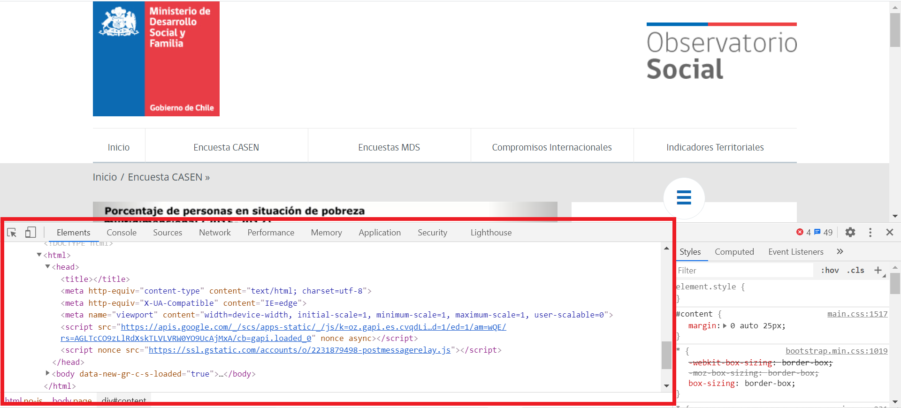
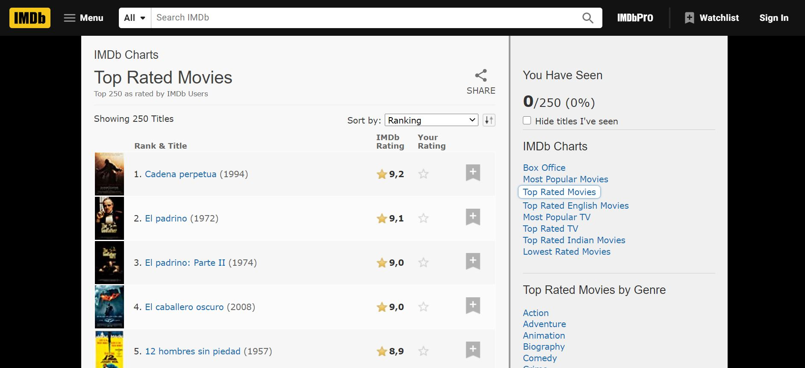

```{r setup, include=FALSE}
library(knitr)
library(hrbrthemes)
library(fontawesome)
library(tidyverse)
library(patchwork)

options(htmltools.dir.version = FALSE)

opts_chunk$set(
  fig.align="center",  
  fig.height=4, #fig.width=6,
  # out.width="748px", #out.length="520.75px",
  dpi=300, #fig.path='Figs/',
  cache=T,#, echo=F, warning=F, message=F,
  echo = TRUE,
  message = FALSE,
  warning = FALSE,
  error = FALSE
  )
```

# ¿Qué veremos hoy?

- Introducción a Web scraping
  
- Ejemplos de *Machine Learning* para Políticas Públicas

---
class: inverse, center, middle
name: arbol

# Web scraping

<html><div style='float:left'></div><hr color='#EB811B' size=1px width=796px></html>

---

# ¿Qué es?

#### Objetivo: obtener información de la web

Distintas formas:

--

- Click y descargar

--

- API: *Application Programming Interface*
  * Interactuar directamente con la API
  * Usar paquetes que facilitan su uso desde `R`
  
--

- __*Web scraping*__

---

# ¿Cómo?

```{r, echo = FALSE, out.width="120%"}

```

---

# Un poco de ayuda

`vignette("selectorgadget")`

```{r, echo = FALSE, out.width="180%"}

```

---

# Demo - Web scraping

- `web_scraping.R`
- `rvest`
- Ejemplo no "muy políticas públicas" pero bueno para demostrar el punto
  * **IMDb**: *Internet Movie Database*

```{r, echo = FALSE, out.width="120%"}

```

---

# Tengan en cuenta...

- El ejemplo que vimos lo hace ver bastante fácil. Muchos casos lo son

--

- Pero... algunas *web* son más difíciles de "scrapear" que otras

--

- Existen otros paquetes para cosas más complejas
  * `RSelenium`

---
class: inverse, center, middle
name: clust

# Casos de ML en Políticas Públicas

<html><div style='float:left'></div><hr color='#EB811B' size=1px width=796px></html>

---

# Educación 

#### Objetivo: Incrementar tasas de graduación del colegio

--

- 1 de cada 5 estudiantes de USA no se gradua de *high-school* a tiempo

--

- Existen programas de intervención para ayudar a los estudiantes que estén en riesgo de no graduarse a tiempo

--

- **¿Cómo identificar a estos estudiantes? ¿Cómo diferenciar cuáles tienen mayor o menor riesgo?**

--

- Distritos escolares de *North Carolina*, *Virginia*, y *Washington* han desarrollado modelos predictivos con el fin de estimar el riesgo de que un alumno no se gradue a tiempo

---

# Educación (cont)

$$NoGraduadoATiempo=\hat{f}(X)$$

--

$NoGraduadoATiempo=\{1,0\}$

$X=\{notas, NSE, N\_detenciones, ActExtPrg, ...\}$

--

- Se puede ocupar información del pasado (por ejemplo, 2010 a 2019) para entrenar y testear distintos modelos

--

- Con el mejor modelo se pueden tomar las características de los alumnos actuales ( $X$'s) y predecir $NoGraduadoATiempo$ ( $Y$)

--

- Como la variable a predecir, $NoGraduadoATiempo$, es binaria (1/0), lo que se obtiene como resultado es un valor de "riesgo (probabilidad) de no graduarse a tiempo" (entre 0 y 1).

--

- El valor de "riesgo de no graduarse a tiempo" sirve como un indicador con el cual rankear de mayor a menor los estudiantes a los cuales apoyar.


---

# Medición de pobreza
  
#### Objetivo: tener indicadores de pobreza actualizados con mayor frecuencia

--

- Encuestas dan información muy valiosa pero son costosas

--

- Lo anterior significa que se realizan cada cierto número de años (Ej: CASEN cada 2 años)

--

- **¿Existe una forma de tener información actualizada con mayor frecuencia?**

---

# Medición de pobreza

#### Idea: buscar variables con alto poder predictivo de pobreza pero que se puedan obtener con mayor frecuencia

--

- Existen distintos estudios que vinculan la intensidad lumínica nocturna con actividad económica (*PIB*) y recientemente también con posesión de activos y pobreza

$$Pobreza = \hat{f}(IntensidadLuminicaNocturna, ...)$$

--

- Intensidad lumínica es una variable que se puede obtener a través de imágenes satelitales ("mapa") y que se puede discretizar ocupando, por ejemplo, los límites comunales de Chile.

--

- Ejemplo de aplicación: tomar la información histórica de CASEN y entrenar un modelo predictivo de pobreza comunal usando intensidad lumínica (y otras variables) como predictor

--

- Trabajo necesario: obtener la información de intensidad lumínica a nivel comunal (imágenes satelitales)

--

- Teniendo un modelo podemos luego obtener información de intensidad lumínica, por ejemplo, cada 6 meses para estimar pobreza de forma más frecuente

---

# Medio ambiente

#### Objetivo: disminuir el potencial impacto ambiental o de la salud de las personas a través de un plan de fiscalizaciones efectivo

--

- En USA existen 300.000 establecimientos regulados por la *Clean Water Act* y que, por ende, la **EPA** (*Environmental Protection Agency*) debe fiscalizar

--

- Debido a las capacidades institucionales, se fiscalizan aproximadamente 28.000 establecimiento cada año (>10%) y durante 2012 y 2016 solo el 25% fue inspeccionado al menos una vez

--

- Las inspecciones son caras por lo que es necesario que cada una de estas sea ocupada de la forma más eficiente posible

--

- **¿Cómo escoger una lista de establecimientos a fiscalizar que maximice el uso de los recursos de la institución?**

--

- Hace algunos años la **EPA** ha estado testeando modelos predictivos para calcular la probabilidad de que una fiscalización encuentre un incumplimiento

---

# Medio ambiente (cont)

#### Idea: 

$$Incumplimiento = \hat{f}(CaracterísticasEstablecimiento, Ubicación, ...)$$

--

- En la Superintendencia del Medio Ambiente estamos trabajando en algo similar a esto

--

- También estamos trabajando en un modelo predictivo de calidad del aire para la zona de Concón, Quintero, y Puchuncaví

---

# Comentarios

- Muchos problemas de políticas públicas no son de predicción
  * Importante dedicarle tiempo a pensar si estas herramientas son o no aplicables
  
_ Cuando se identifica un problema de predicción se tiene la ventaja, en general, de tener muchos datos administrativos disponibles
  
- Queda mucho por avanzar todavía. Primer paso, tener datos disponibles de forma simple.

---

# Próxima clase

- Última clase

- Presentaciones
  * Máximo 8 minutos de presentación
  * Máximo 4 minutos de preguntas
  * 15 minutos de break
  
- Informe final: sábado 17 de octubre 23:59